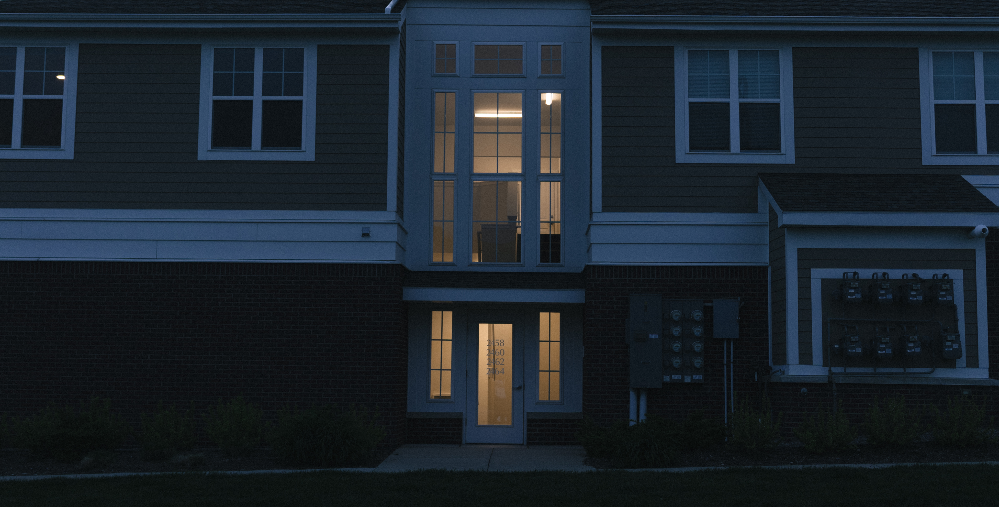
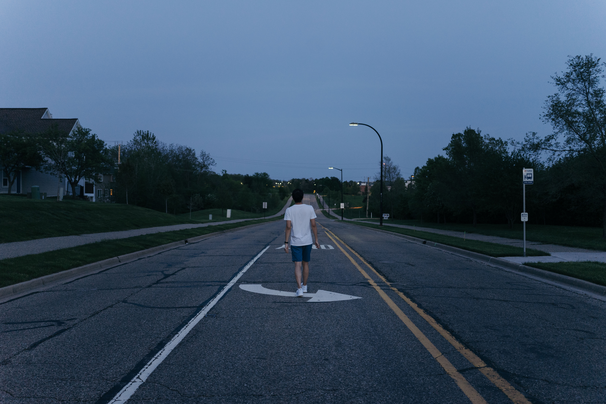
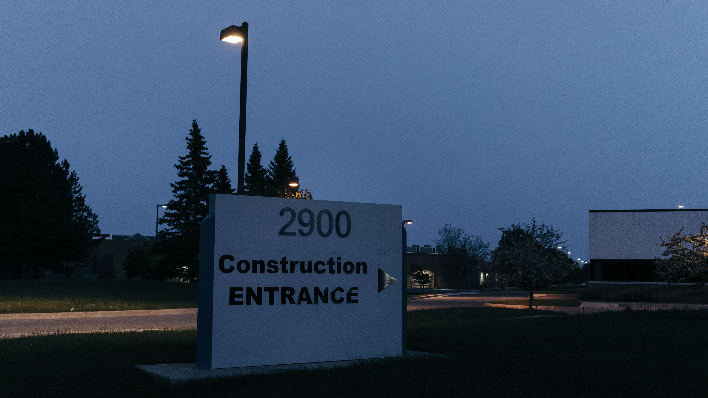
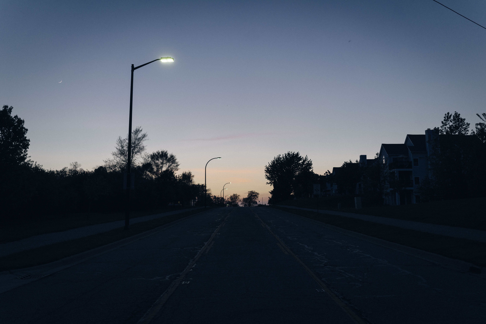
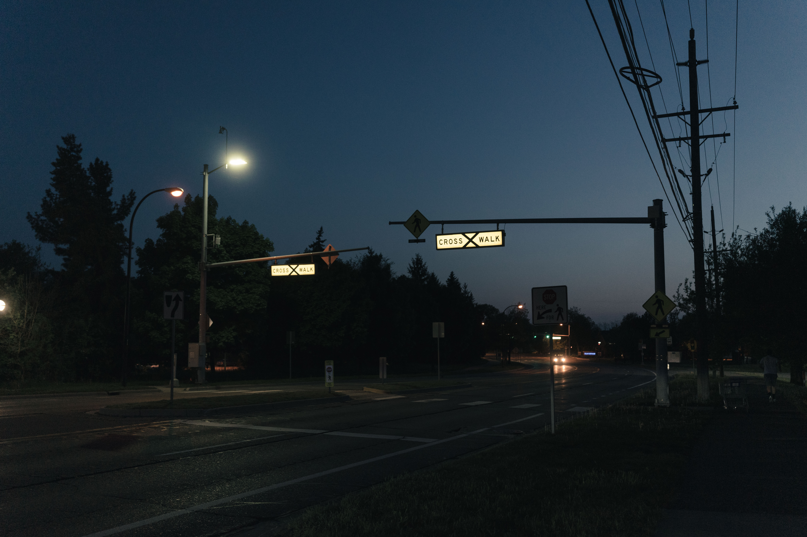

"Blue Hour," by definition, is the time period in a day when the world is covered in blue lights from the dusk or the dawn. It is usually formed in the period of twilight in the morning or in the evening when the sun is right below the horizon (more details check [Wikipedia](https://en.wikipedia.org/wiki/Blue_hour)). 

**Blue hour is so famous due to its beauty**. During this period, all the surroundings would be covered in the romantic blue, indicating the end of the day and the start of the night. Many famous movies, such as "[La La Land](https://www.imdb.com/title/tt3783958/)," features the beauty of the blue hour.

<!-- more -->

## Blue Hour in Ann Arbor, MI

