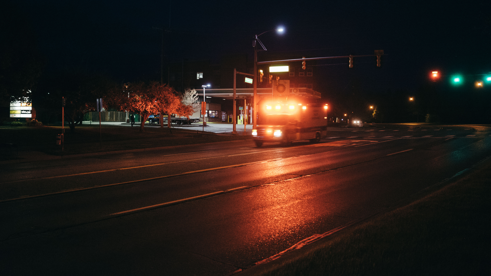

As COVID-19 virus spread around the world causing serious pandemic and deaths, it also has seriously impacted countless people's lives. As a resident in the United States, my everyday life has also been affected by this pandemic in multiple aspects. After making sure that social distancing can be properly kept when I was outdoors, I decided to take my camera and witness the changes of my daily life.

<!-- more -->

## Ann Arbor, MI

*One of the most significant changes in my life is the wide use of face masks. An N95 mask seems to be disposed on the grass.*

*As the pandemic spreads, ambulances are frequently rushing along one of the main street in Ann Arbor, MI, day and night.*
