Of all the places I've been to, Zhuhai, by no doubt, is the most special one to me. I have been to almost everywhere in this city. As I grew up, countless changes have taken place in this city. People went and people came, and the city developed fast.

As a photographer, I have the feeling that it is my responsibility to record her changes every time I return. I really hope that my hometown can become better and better.



<!-- more -->

## Zhuhai, in the City

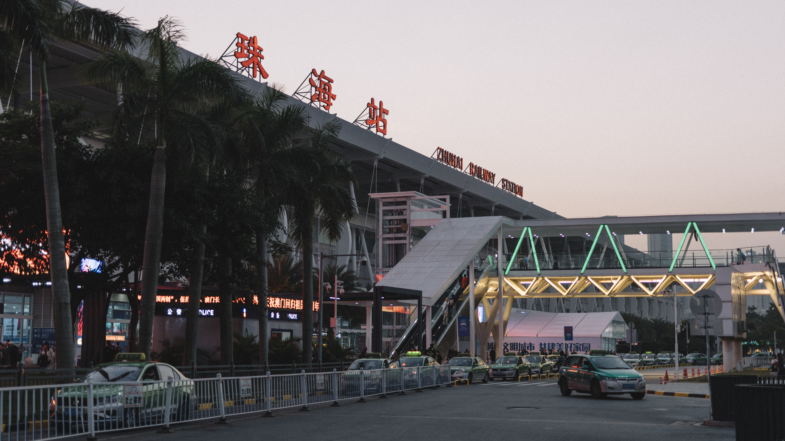

*Zhuhai Railway Station (Chinese: 城轨珠海站). Zhuhai Railway Station is the biggest and busiest train station connected to the high-speed CRH train in China. Dozens or even hundreds of trains leave and enter Zhuhai every day. Zhuhai Railway Station is also the endpoint of [Beijing–Guangzhou–Shenzhen–Hong Kong high-speed railway （Chinese: 京广深高铁线)](https://en.wikipedia.org/wiki/Beijing%E2%80%93Guangzhou_high-speed_railway), which is a railway of over 2,000 kilometers connecting Beijing and Zhuhai. For me, Zhuhai Railway Station is a must-go if I'm going anywhere by train.*

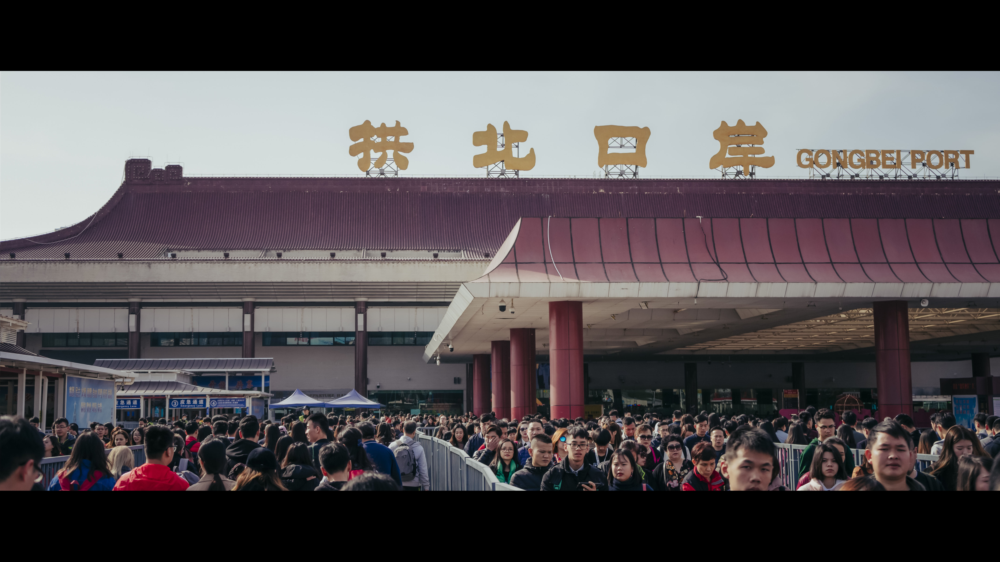

*[Gongbei Port/Gongbei Port of Entry](https://en.wikipedia.org/wiki/Gongbei_Port_of_Entry) (Chinese: 拱北口岸). Gongbei Port is the biggest and the main port on the Zhuhai-Macau border. Every day, there are hundreds of thousands of people traveling to Macau thorugh this port. This picture was captured on the Chinese New Year's Eve in 2018. On that particular day, the total passenger flow exceeded 300,000.*

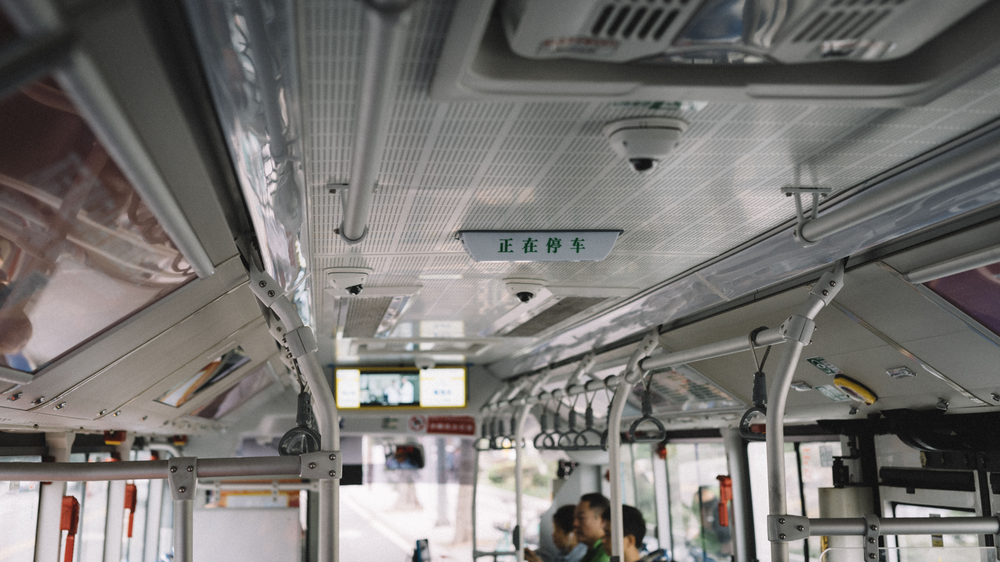

*Zhuhai Bus. Zhuhai buses are frequently changing and developing. 20 years ago, all buses in Zhuhai were still the old, diesel buses. However, with the development of electric vehicles, nowadays Zhuhai buses have all switched to the new, environmental-friendly pure electric buses.*

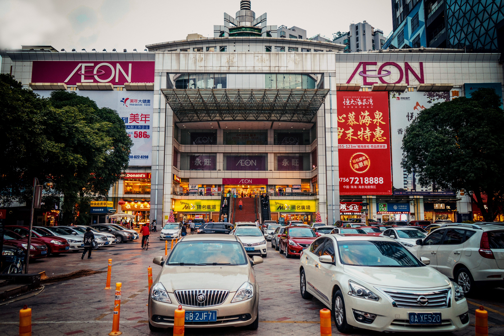

*A typical old supermarket in Zhuhai. When I was young, my parents used to take me here every day after school. For six consecutive years, I bought a lot of things here: new LEGO toy bricks, new shoes, new pens and pencils, new bags, and of course, delicious snacks. This supermarket was once owned by [JUSCO (Chinese: 吉之岛)](https://en.wikipedia.org/wiki/JUSCO), but now the ownership has been transferred to a new corporation called AEON (Chinese: 永旺).*

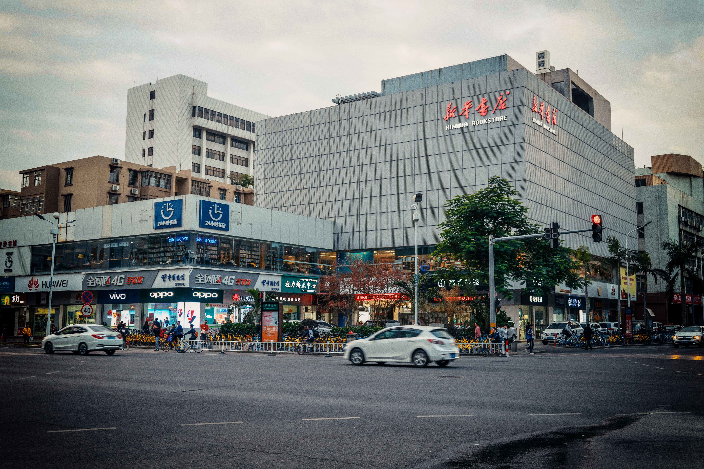

*Fenghuang Rd (Chinese: 凤凰路), Xiangzhou District. Due to the high population density, there will be numerous cars runing along this street every day. Typically, during the morning peak and evening peak, there will be a massive traffic congestion on this street.*

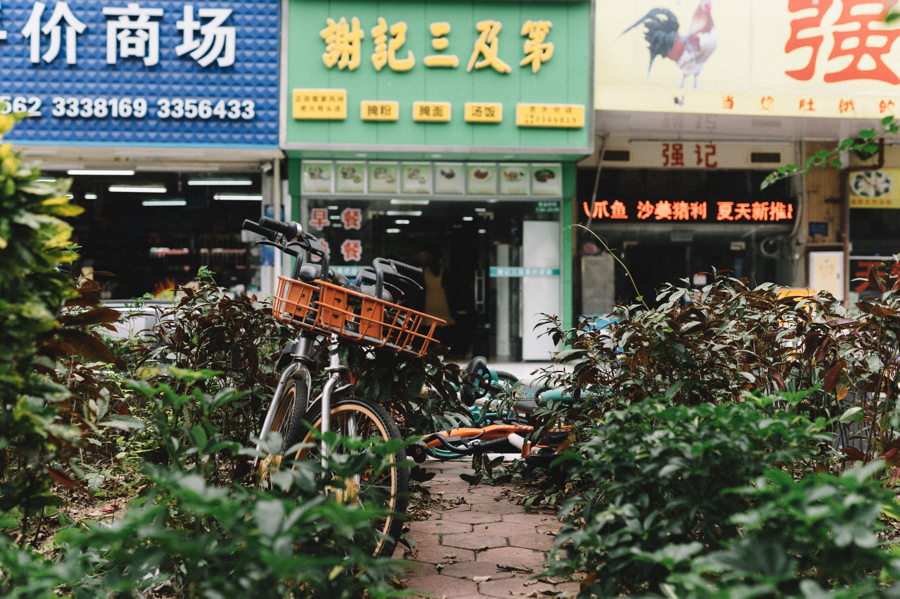

*A combined scene of Chinese bike-sharing system and the small but busy shops along the street.*

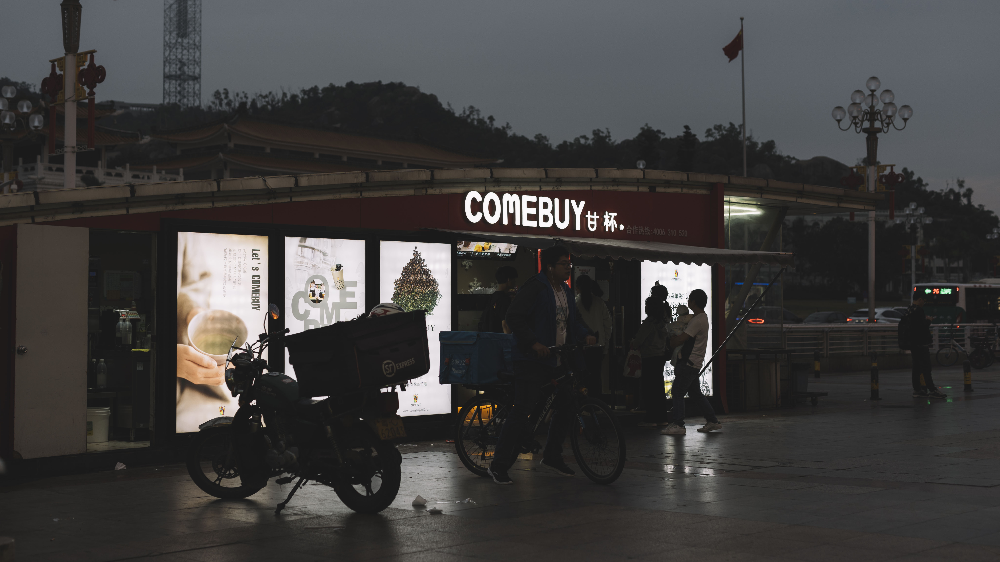

*Comebuy, one of the numerous bubble tea shops in Zhuhai. Comebuy started their business in Zhuhai several years ago and was trying to expand their business all over China.*

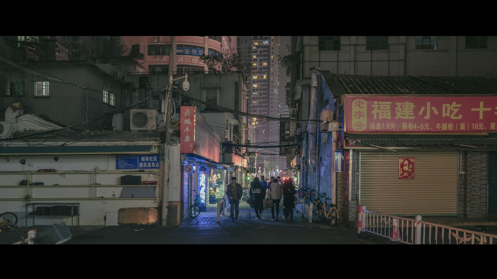

*[Xiangzhou District (Chinese: 香洲区)](https://en.wikipedia.org/wiki/Xiangzhou_District,_Zhuhai). An old small alley among the buildings. Xiangzhou District is one of the oldest area in Zhuhai, which originates from a tiny village 40 years ago. It is still the political, financial and cultural center of Zhuhai. Just like the countless other alleys, most of the food stalls here have a very long history, and any of them is able to satisfy your appetite.*

## Zhuhai, By the Sea

Zhuhai, as a coastal city, has a really pretty seaside view. Although I cannot guarantee that it is as gorgeous and magnificent as those world-class famous tourism spots such as Maldives, Phuket, Miami, etc., **it actually reflects the exact feeling of "living by the sea."**

The city of Zhuhai is built on several fishing villages. Before the "reform and opening-up" policy in China in 1978, Zhuhai is still a small fishing village. The dwellers at that time still made their living mainly by hunting fish. As Zhuhai develops, although more and more elements of modern cities have been added to this place (such as malls, amusement parks, etc.), what still remains unchanged is the way of living &mdash; Zhuhai citizens still love to hang out by the sea. Lovers love to start their stories by the sea. Beaches are always crowded on weekends and holidays. Fish markets are always the busiest among all markets in the city. Even the landmark of Zhuhai, as I mentioned in my [self-introduction post](https://zhihaoruan.xyz/about/) &mdash; is about fish!

As a result, besides constructing more and more shopping malls in the city, the City Government of Zhuhai also focuses on improving its coastal line. So far, walking by the sea has absolutely become one of the most relaxing activities in the city life. Feel the wind breeze with the smell of the sea. Watch the boats come and go. Enjoy the sunrise and sunset on the beach. When it comes to the sea, Zhuhai turns into a romantic city.

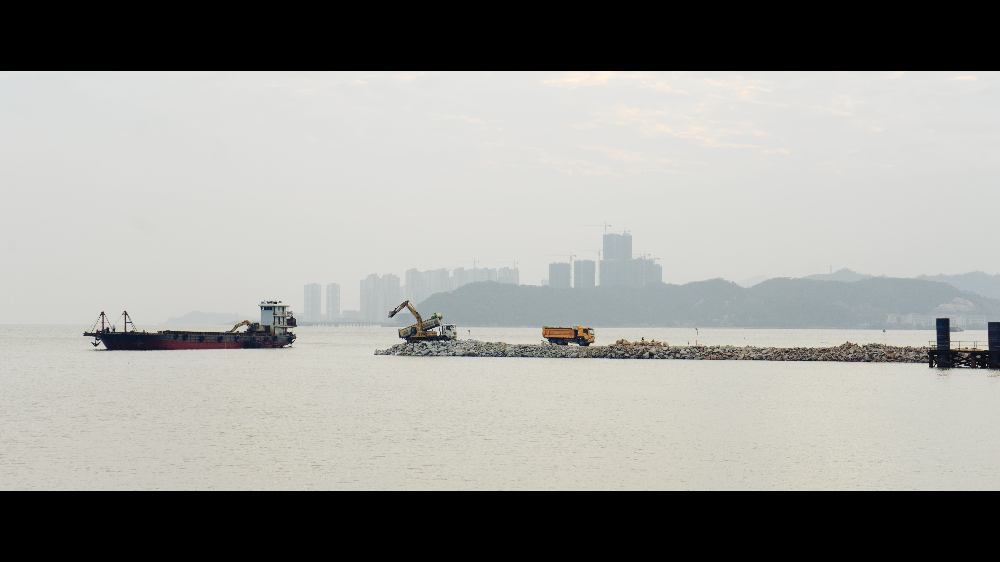

*[Qi'ao Island (Chinese: 淇澳岛)](https://en.wikipedia.org/wiki/Qi%27ao_Island). A construction site on a pier. After the successful tryout of [Hengqin Free Trade Zone (横琴自贸区)](http://en.hengqin.gov.cn/), Qi'ao Island seems to be planned to become the second center of the [Guangdong-Hong Kong-Macau Greater Bay Area (粤港澳大湾区)](https://en.wikipedia.org/wiki/Guangdong-Hong_Kong-Macau_Greater_Bay_Area).*

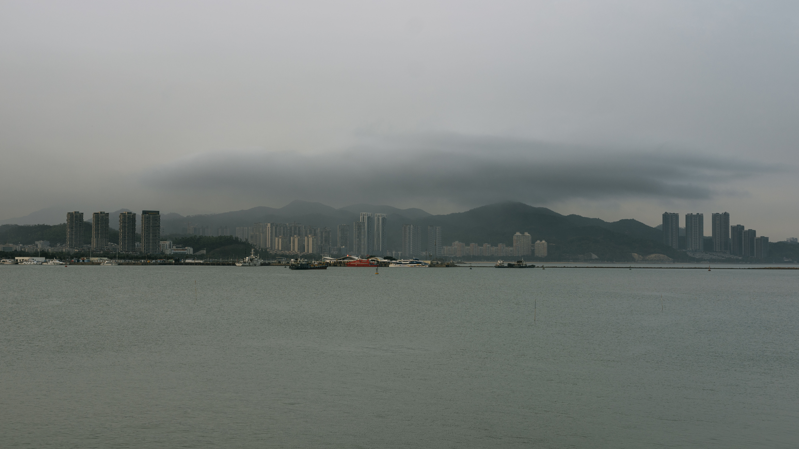

*Captures of the coastal line in a stormy afternoon.*

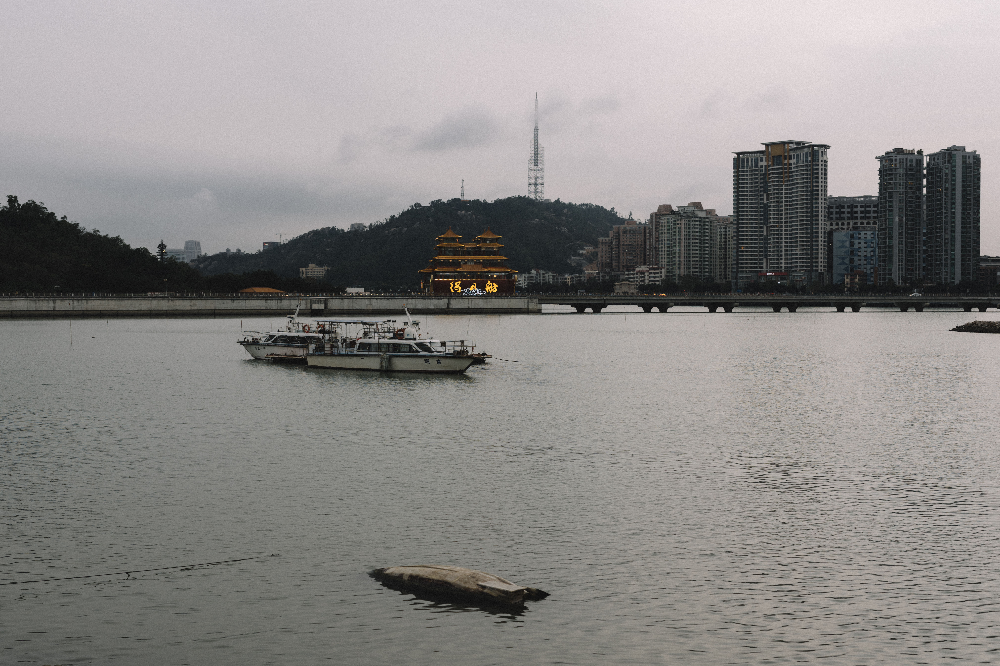

*Xianglu Bay (Chinese: 香炉湾), the most historical bay in the city. Two small fishing boats are parked in the water, with a traditional ship-shaped restaurant captured not far away.*

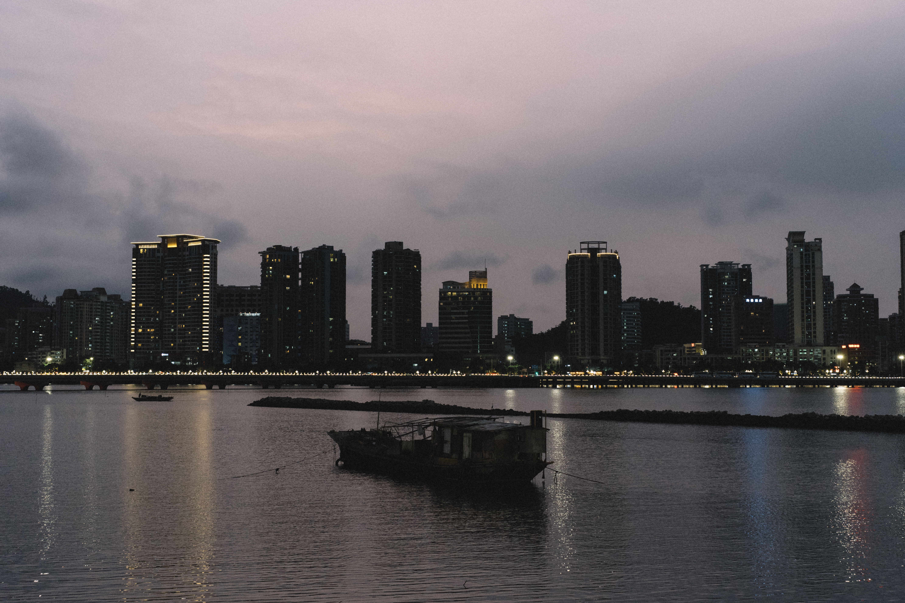

*City view and the Xianglu Bay in the evening. The sky had not yet become completely dark, and the lights in the city were just lit up.*
