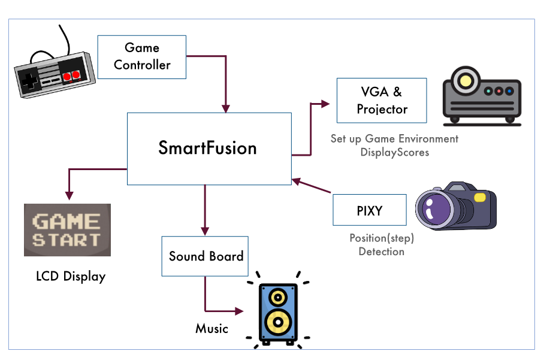
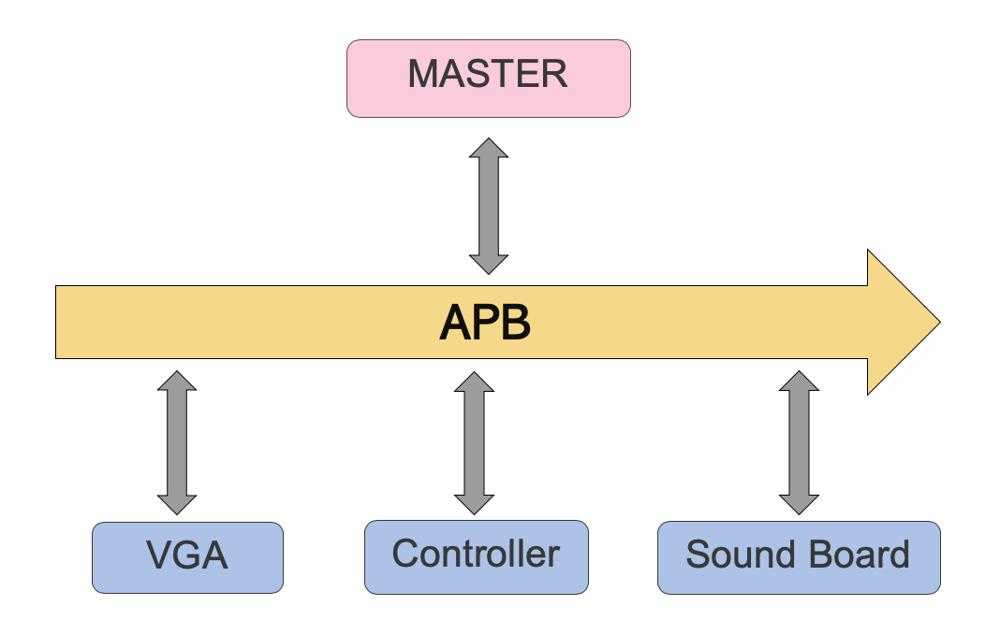
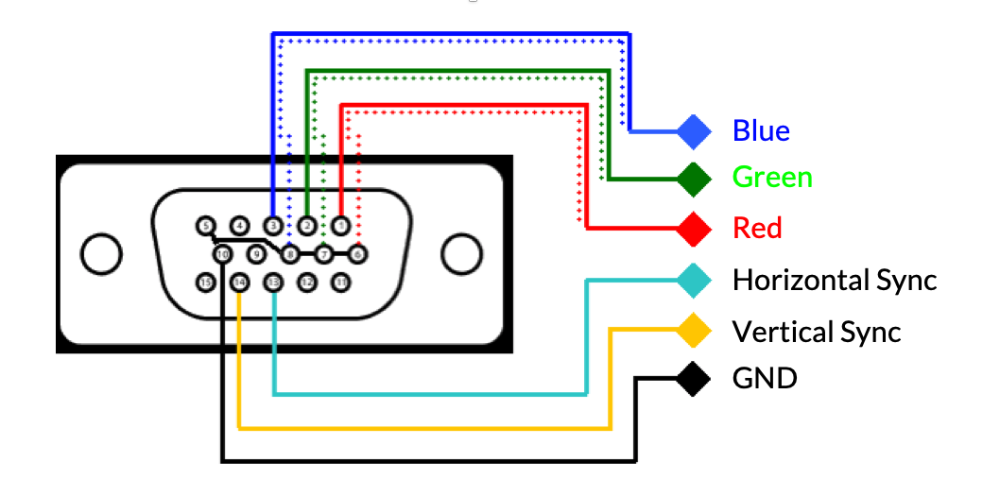
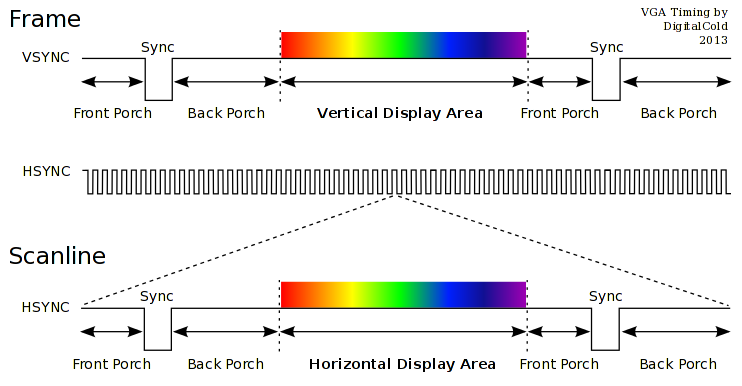
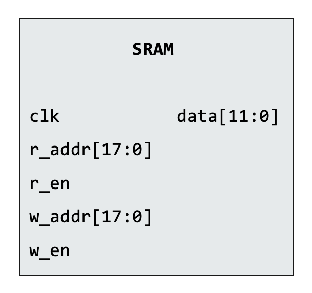
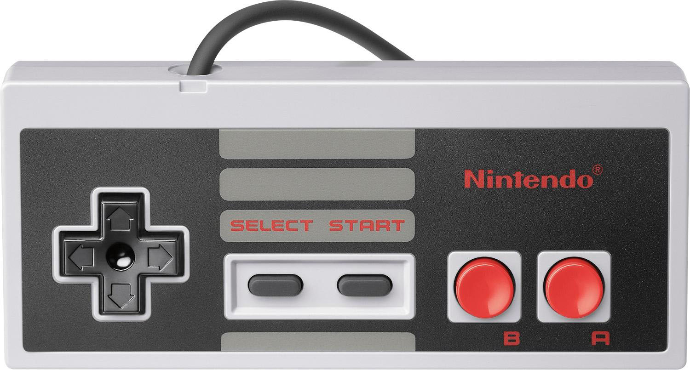
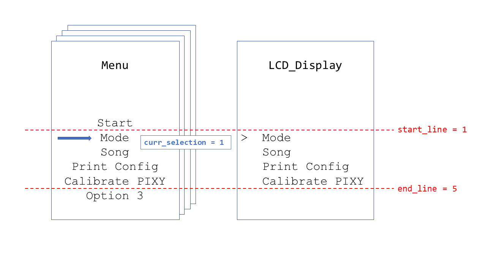
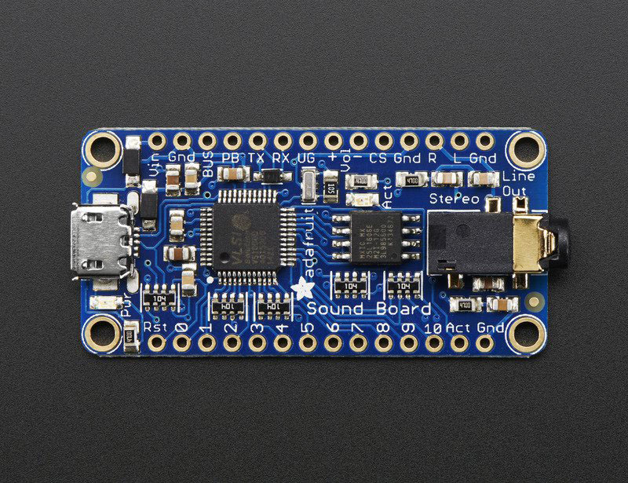
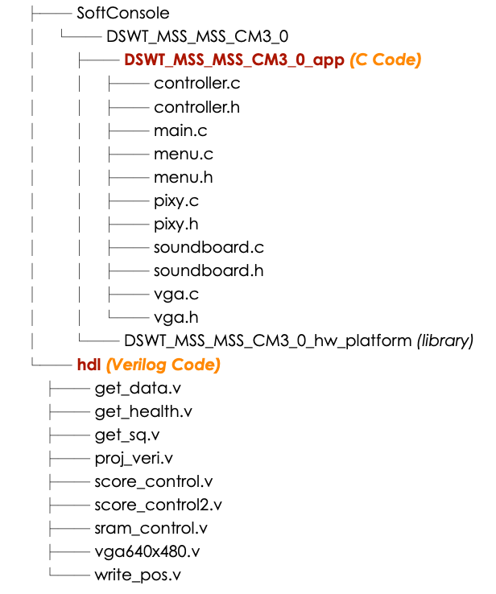

> Probably one of the best interactive game projects I have seen in the class.</p>
> — <cite>Prof. Alanson Sample and Prof. Matt Smith, University of Michigan</cite>

<br>

**> *This project is developed together with [Regina (Jingliang Ren)](https://regina8023.github.io), [Kun Huang](https://voyager1998.github.io) and Shiyu Liu.***</br>
**> *This post is written in shared effort with [Regina (Jingliang Ren)](https://regina8023.github.io).***</br>
**> *Special thanks to them for all their contributions!***
<!--more-->

In the passing winter semester, I took a very interesting course: [*Introduction to Embedded System Design (EECS 373)*](http://www.eecs.umich.edu/courses/eecs373/lectures.html). I've learned memory-mapped I/O, interrupt, timer and many other important concepts in embedded system. The target of this course is to build an embedded system using a specific kind of development board -- [Actel SmartFusion&reg; SoC FPGA](https://en.wikipedia.org/wiki/Actel_SmartFusion).

Our final project is "Step on the White Tiles", which is inspired by a popular mobile game *Don't Tap the White Tiles (Chinese: 别踩白块)*. This is one of my proudest projects, so I'd like to write a blog to record this project experience and share these fun technical details with more people!

## Background: Interactive Gaming

Interactive gaming system has been developing fast for the past decades. From the Wii Remote controller created by Nintendo to the PlayStation series controller invented by Sony, it seems that people has become more and more fascinated about interactive gaming. Inspired by the existing interactive gaming system solutions, I, along with [Regina (Jingliang Ren)](https://regina8023.github.io), [Ken (Kun Huang)](https://voyager1998.github.io) and Shiyu Liu planned to develop a simple interactive gaming system based on [Actel SmartFusion&reg; SoC FPGA](https://www.microsemi.com/product-directory/soc-fpgas/1693-smartfusion), which is a simple implementation of a popular mobile game *Don't Tap the White Tiles* into the real world.



## Game Rules

There are 3 modes for our game: slow, medium and fast. Different modes have different numbers and speeds of tiles. At the beginning of the game, player will have 5 lives (health points).

* 🍭 When left foot steps on a white tile, white tile becomes green and score++
* 🍭 When left foot steps on a white tile, white tile becomes red and score++
* 🌶 When player misses a white tile, he/she will lose one life (health point)
* ☠️ When all lives go, game over!

## Demo Videos

Here is a video captured during EECS373 Project Expo 😎!



## Technical Details

In the following part, I will be introducing in detail how to build this cool interactive gaming system! As mentioned before, in this project we're using Actel SmartFusion&reg; SoC FPGA.

### Component Overview



As indicated in the graph, we use one SmartFusion&reg; board to control 5 main peripherals:

* Nintendo controller and LCD display for calibration Pixy camera, setting game mode, controlling start and pause
* Projector controlled by VGA signal for projecting moving tiles, score, left health point
* Pixy camera for detecting if player's feet are on white tiles
* Sound board for playing background music and sound effect

### Code Environments

As for the project developing environment, we're using [Libero SoC Design Software](https://www.microsemi.com/product-directory/design-resources/1750-libero-soc) as well as [Microsemi SoftConsole](https://www.microsemi.com/product-directory/design-tools/4879-softconsole#overview). The specific versions are:

* Libero SoC v11.9 SP3
* Microsemi SoftConsole v3.4
* Windows 10 Pro 1809 (operating system)

**Note that Libero SoC is neither forward nor backward compatible.** A Libero SoC v11.9 project is not compatible with a Libero SoC v11.9 SP3 project.

### Memory-mapped I/O & Advanced Peripheral Bus

In common sense, every memory address in a CPU corresponds to some place which can store data (aka "real memory"). However, in embedded systems, each input/output (I/O) device also corresponds to a specific memory address in the core. For these addresses, each of them has been mapped to an I/O device instead of "real memory", such as Analog-to-Digital Converter (ADC), Digital-to-Analog Converter (DAC), General-Purpose I/O (GPIO) pins, etc. Accessing these addresses through CPU is actually accessing their corresponding I/O devices.

APB (Advanced Peripheral Bus) is used as an interface to access these peripherals. A typical APB consists of the following signal (by naming convention):

| Signal Name | Meaning                                                                                           |
| :---------: | ------------------------------------------------------------------------------------------------- |
|  `PRDATA`   | Data line where CPU reads from the peripheral.                                                    |
|  `PWDATA`   | Data line where CPU writes to the peripheral.                                                     |
|  `PWRITE`   | Indicates whether it is a **read** or a **write** transaction.                                    |
|  `PENABLE`  | Indicates whether CPU has started the transaction.                                                |
|   `PSEL`    | Indicates whether CPU has selected this peripheral.                                               |
|   `PADDR`   | Indicates what address CPU has chosen to interact with.                                           |
|   `PCLK`    | Clock signal from CPU.                                                                            |
|  `PREADY`   | **Controlled by peripheral;** indicates whether peripheral has been prepared for the transaction. |

By convention, in terms of APB, the CPU is called "master" while the peripherals are called "slaves". While signals are generally high/low voltages which is in essence a hardware issue, APB makes generating these signals with C code possible.



#### Implementation in Verilog

While in most microcontrollers APB is not able to be modified because it is a very complicated circuit network soldered onto the PCB, with an FPGA we can take full advantage of that and customize our own APB. In Verilog, we can simply make use of an unused memory address and create the following module (APB interface):

```verilog
module apb_interface(
        input PCLK,                 // clock
        input PRESERN,              // system reset
// APB3 BUS INTERFACE
        input PSEL,                 // peripheral select
        input PENABLE,              // distinguishes access phase
        output wire PREADY,         // peripheral ready signal
        output wire PSLVERR,        // error signal
        input PWRITE,               // read/write control bit
        input [31:0] PADDR,         // IO address
        input wire [31:0] PWDATA,   // (processor) bus is writing data to
                                    // this device 32 bits
        output reg [31:0] PRDATA,   // (processor) bus is reading data from this device
        /*** Your Code (inputs & outputs) ***/
);

assign PSLVERR  = 0;    // assumes no error generation
assign PREADY   = 1;    // assumes zero wait
wire write_enable   = (PENABLE && PWRITE && PSEL);  //decodes APB3 write cycle
wire read_enable    = (!PWRITE && PSEL);            //decode APB3 read cycle
// ****** Your code ******
endmodule
```

We can see that all the I/O ports in the Verilog module has to strictly follow the APB convention mentioned above.

### VGA

VGA is short for *Video Graphics Array*. Although it is a relatively aged display method (introduced by IBM in 1987), its frequency (60Hz per frame) is good enough for our display purpose.

#### Basics



A VGA cable has 15 pins, 6 of them are used in the project:

* Blue, Red, Green represent color for one pixel
* Horizontal sync and vertical sync are used to define the ends of each line and the whole frame
* GND for ground

A VGA video is a **stream** of frames. Each frame is made up of a series of horizontal lines, and each line is made up of a series of pixels.

At the beginning, there will be a scan point on top left corner of the frame. In each clock period, we should output correct RGB value for current pixel.  And the scan point will go to the next pixel. When it comes to the end of a line, the Horizontal-Sync signal will go low.

Then the scan point goes line by line. When it comes to the end of the frame, the Vertical-Sync will go low.

Till now, we refresh the whole frame for one time.



In a word, to project a desired video, we just need to **output correct RGB signal for each pixel in sequence**.

#### Implementation

The main logic for VGA display is implemented in C code: it determines the positions of tiles, scores and health point; then writes these information in specific APB addresses. Verilog code is only for analyzing information from these APB addresses and generating corresponding signals.

A 60-Hz interrupt will be generated periodically in fabric. In `main.c`,

```c
__attribute__((interrupt)) void Fabric_IRQHandler(void){}
```

is interrupt handler, which is responsible for refresh of the whole frame.

##### Moving Tiles

There are 8 tiles in maximum in one frame. To make them look as random as possible, I randomly generate 3 attributes for each tile:

* **length**
* **the column** inside which it will move
* **delay** for interval between the time when a tile goes out of the frame and when it reappears at the top of the frame.

In `vga.c`,

```c
void random_mode(int k) {}
```

controls the new position of kth tile based on its old position.

Besides, the attribute, **`left_on`**, **`right_on`**, will control color of the tile. When it is set to `true` inside `pixy.c`, the color will turn green or red.

##### Score & Health Point

Once **`left_on`** or **`right_on`** is set to `true` inside `pixy.c`, the variable, **`score`**, will add one.

If **`left_on`** and **`right_on`** are `false` until the tile goes out of the frame, one life will lose.

The display of score 🔢 and heart ❤️ are hard-coded in Verilog. Another way to show them is using Sprites + SRAM (see below).

#### Showing More Complicated Graphs

Although the display for this game is fairly simple, we tried using [Sprites](https://ipfs.io/ipfs/QmXoypizjW3WknFiJnKLwHCnL72vedxjQkDDP1mXWo6uco/wiki/Sprite_(computer_graphics).html) and SRAM, which is used for complicated graphics (but didn't use it in final version of project).

The idea behind Sprites is that generate RGB values for each pixel in a picture; and then store them in SRAM of microcontroller; read RGB value for corresponding pixel from SRAM when scan point comes to the pixel.



The SRAM module inside SmartFusion&reg; is shown above. Pull up `r_en` when you are reading from it, pull up `w_en` when you are writing to it.

However, there are two annoying issues when I implemented it:

* Timing. When use APB and SRAM, timing of these two things need to be considered carefully. The `PREADY` cannot be set to high all the time since SRAM need one clock period to finish reading/writing. So `PREADY` should be delayed for one clock period.
* Memory limitation. The total size of SRAM inside SmartFusion&reg; is only 64kB.

### Nintendo Controller

For the controller for the user menu selection, we're using a classic Nintendo&reg; NES controller. This is a relatively aged controller, but its signal is easy to decode and it's sufficient for our design.



We can see that it consists of 8 buttons: Up, Down, Left, Right, Select, Start, A and B.

For more details, [a document that I have referred to](http://uzebox.org/files/NES-controller-Hydra-Ch6All-v1.0.pdf) when programming the NES controller says that:

> The Nintendo Entertainment System or NES, also known as the Nintendo Family Computer (Famicom) was released in Japan in 1983 and shortly after in the USA in 1985. The system was even more successful than the Atari 2600 and more or less put the last stake in the heart of Atari home consoles forever. The NES sold more than 60,000,000 units worldwide in its heyday and still sells to this day (I just bought 4 of them from eStarland.com)! There are over 200 clones of the system in circulation and the word "Nintendo" is used in many cultures as a youth slang term with many "varied" meanings.
>
> The system itself was nothing compared to the Propeller chip’s computing power, the NES was powered by the 8-bit 6502 running at 1.79 MHz, but the NES did have quite a bit of dedicated graphics hardware making it quite a contender in the 8-bit era, it sported multiple tile maps, graphics planes, sprites, sound, and a lot more.
>
> — <cite><i>"Game Programming for the Propeller Powered HYDRA"</i>, pp. 95</cite>

#### Interfacing the Nintendo NES controller

On the back of the NES controller, it is actually organized as the following figure shows.



We can see that there're five wires: brown, red, orange, yellow, white. The functions of these wires are summarized below.

| Signal Name | Meaning |
| :---------: | :-----: |
|    `GND`    |  Brown  |
|   `clock`   |   Red   |
|   `latch`   | Orange  |
| `data_out`  | Yellow  |
|    `5V`     |  White  |

The states of the 8 buttons (pressed/not pressed) will be provided at the `data_out` line, bit by bit. The `latch` and the `clock` line are used to control the clocking of the `data_out` data line. In order to get the button states from the NES controller, we need to perform the following steps.

1. Set the clock of the MCU to be greater than or equal to $12\mu\rm{s}$.
2. Set `latch` line to LOW.
3. Set `clock` line to LOW. Now, we're in a known state.
4. Pulse `latch` line HIGH for at least 2 cycles. This will latch the data into the shift register.
5. Read the bits in from `data_out` line. The first bit will be available after the latching process.
6. Pulse `clock` line 7 times to read the remaining bits.

***Note. The bits are inverted from the data line (LOW for pressed, HIGH for not pressed).***

Based on the above rules, we can create a logic in Verilog that keeps reading the button states of the NES controller in the background. To keep things simple, we use APB interface to interact with the C coding parts, and we organize the 8 button states to be in the form of an 8-bit integer in a specific APB address that can be accessed with C code.



As we're using 25MHz clock on our SmartFusion&reg; board, we need to extend our clock signal to $12\mu\rm{s}$. Thus, we need a clock divider.

```verilog

reg [9:0] clock_divider;
assign clock_divider_max = (clock_divider == 10'd150);

always @(posedge PCLK) begin
    if (~PRESERN) begin
        clock_divider <= 10'd0;
    end
    else if (clock_divider_max) begin
        clock_divider <= 0;
    end
    else begin
        clock_divider <= clock_divider + 1;
    end
end
```

Then, we need to create our logic to pulse the `latch` and `clock` signal, and get the bits from `data_out`. **Whenever we read a new bit in, we need to shift all the old bits left by 1.**

```verilog

reg [7:0] data_in, data_complete;
reg [2:0] read_count;
reg start, finish;

always @(posedge PCLK) begin
    if (~PRESERN) begin
        latch         <= 0;
        clock         <= 0;
        start         <= 1;
        finish        <= 0;
        count         <= 5'd0;
        data_in       <= 8'd0;
        data_complete <= 8'd0;
        read_count    <= 3'd0;
    end
    if (finish == 1) begin
        data_complete <= data_in;
        finish        <= 0;
        start         <= 1;
        clock         <= 0;
        data_in       <= 8'd0;
    end
    if (clock_divider_max) begin
        if (start == 1) begin
            // latch the first data
            latch <= 1;
            start <= 0;
        end
        if (latch == 1) begin
            latch <= 0;
        end
        if (clock == 1) begin
            clock <= 0;
        end
        if (data_en) begin
            // latch data
            // data are inverted bits
            clock      <= 1;
            data_in[7] <= data_in[6];
            data_in[6] <= data_in[5];
            data_in[5] <= data_in[4];
            data_in[4] <= data_in[3];
            data_in[3] <= data_in[2];
            data_in[2] <= data_in[1];
            data_in[1] <= data_in[0];
            data_in[0] <= ~data;
            read_count <= read_count + 1;

            if (read_count == 3'd7) begin
                // latch the last data
                finish     <= 1;
                read_count <= 3'd0;
            end
        end
    end
end
```

### LCD Display

We use [Sparkfun's $20\times4$ serial enabled LCD display](https://www.sparkfun.com/products/9568) in our project. The interface of this LCD is actually really simple &mdash; just UART. If you send a character `a` to it through UART, it will display an "a" on the screen; if you send a string `Hello World` to it, it will display "Hello World".



It is worth noticing that this LCD module displays characters based on the position of a cursor. This is very similar to writing on a text file. The character sent to the module will always be written at the position of the cursor. For instance, if the current cursor position is at the first position of the first line, the incoming character `a` will then be displayed at the first position in the first line. What is worth mentioning is that there are some special ASCII character pairs that have special meanings and have been hard-coded into the LCD module. For example, some of these special characters are:

| Character Value | Meaning                                                                                                                                                                                                                                                                                                                                                                                                                                   |
| :-------------: | :---------------------------------------------------------------------------------------------------------------------------------------------------------------------------------------------------------------------------------------------------------------------------------------------------------------------------------------------------------------------------------------------------------------------------------------- |
|  `0xFE, 0x01`   | Clear the entire display.                                                                                                                                                                                                                                                                                                                                                                                                                 |
|  `0xFE, 0x80`   | Set cursor position to be the first position in the 1<sup>st</sup> line. The 20 values starting from `0x80` correspond to the cursor positions from the beginning of the 1<sup>st</sup> line to the end of the first line. For the first position in the 2<sup>nd</sup> line, add 64 to `0x80`; for the first position of the 3<sup>rd</sup> line, add 20 to `0x80`; for the first position of the 4<sup>th</sup> line, add 84 to `0x80`. |
|     `0x12`      | Reset the whole module.                                                                                                                                                                                                                                                                                                                                                                                                                   |

***Note. Two bytes separated by a comma means a consecutive ASCII character pair.* For instance, `0xFE, 0x80` means `0xFE` should be first sent to the LCD module, followed by a `0x80`.**

#### Constructing the User Menu

In terms of constructing a complete user menu, we use `>` as the prompt character for the selected option. We develop a data structure called `LCD_Display` to store the current contents of the 4 lines as well as the line index of the prompt character, and another `Menu` for multiple layers of the menu. For simplicity, we set each layer of the menu has a maximum size of 6.



For more detailed information, please visit our [GitHub repo](https://github.com/shineyruan/Don-t-Step-on-White-Tiles) and take a look at the `menu.[ch]` library files.

### Pixy Camera

[Pixy camera](https://pixycam.com/) is a small and responsive open-source camera developed by CREATE Lab, a part of the Robotics Institute at Carnegie Mellon University. It is equipped with color recognition and it can tell the location of the object in real time within its field of view. It has a very nice interface for MCU, which we can integrate into our SmartFusion&reg; board. Particularly, it is able to transmit its color recognition results to MCU via three interfaces: I2C, SPI, and UART. It is known that SPI has the highest data transmission rate among the three popular protocols, so we decide to utilize its SPI interface.

#### Porting Guidelines

According to the [official documentation](https://docs.pixycam.com/wiki/doku.php?id=wiki:v1:porting_guide), Pixy camera has the following available ports:



with the numbering convention (looking at the back of Pixy):

```text

1   2
3   4
5   6
7   8
9   10
```

#### The Serial Protocol

*Signature* is an important feature of Pixy. A signature represents a particular color: say you may want to set a signature for color red, another signature for color blue, and another signature for color yellow, etc. An *object* is the biggest object with a corresponding signature appearing in Pixy's field of view. That is, Pixy can hold as many objects as the signatures.

The whole information containing in one single image is called a *frame*. A data frame can have several objects corresponding to several signatures. Pixy's protocol enables itself to convey information for multiple objects of different colors at a time. More specifically, its serial protocol goes as follows:

1. The information for each object is 14 bytes in little endian, with the first 2 bytes starting with `0xaa55`.
2. Two consecutive `0xaa55` starts a new frame, with the second `0xaa55` starts the new object.

```text

Bytes    16-bit word    Description
----------------------------------------------------------------
0, 1     y              sync: 0xaa55=normal object, 0xaa56=color code object
2, 3     y              checksum (sum of all 16-bit words 2-6, that is, bytes 4-13)
4, 5     y              signature number
6, 7     y              x center of object
8, 9     y              y center of object
10, 11   y              width of object
12, 13   y              height of object
```

Above are the information needed for us to parse Pixy's data. But how can we transmit data to Pixy to set the signatures? Fortunately, Pixy's group have developed a very nice software called [PixyMon](https://pixycam.com/downloads-pixy1/) for us to accomplish this goal. This software sets up a UART communication between PC and Pixy camera, and it can transmit data to it as soon as we click the corresponding button in the software.

By the means mentioned above, we're able to get the center of the objects with specific color within Pixy's field of view, which is a very nice method to locate the player's feet in our project.

Meanwhile, there are also other advanced features of Pixy that we haven't explored. For details, please visit their [official website](https://pixycam.com/).

### Sound Board

We use [Adafruit Audio FX Mini Sound Board](https://www.adafruit.com/product/2341) for playing background music.



By plugging in the sound board into computer using USB cable, it will show up as a new USB key. Just copy music into it and music will be written properly in its memory.

To trigger audio, pull down one of trigger pins - named `#0` thru `#10`. To stop audio, pull down `Rst`.

The control of this board also uses the Verilog APB interface.

## Source Code

All source codes with the latest updates can be accessed in my [GitHub repository](https://github.com/shineyruan/Don-t-Step-on-White-Tiles). A project directory structure is also provided below. **Special thanks to Regina for her drawing the project directory structure!**



## Acknowledgements

For the entire work, I would like to express special thanks to:

* Prof. Sample and Prof. Smith's support throughout the semester ☕️🥃
* my teammates: Shiyu, Regina and Ken's efforts on this project 🍦🍻
* my own passion 🍗🍺
