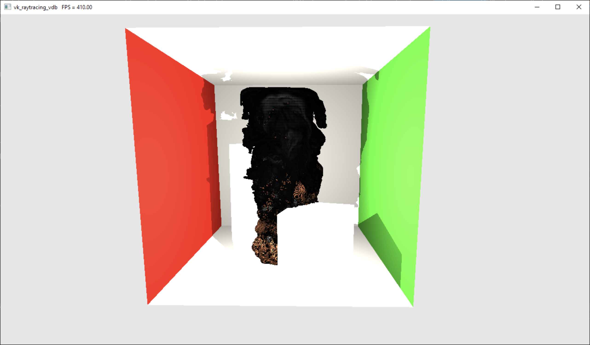
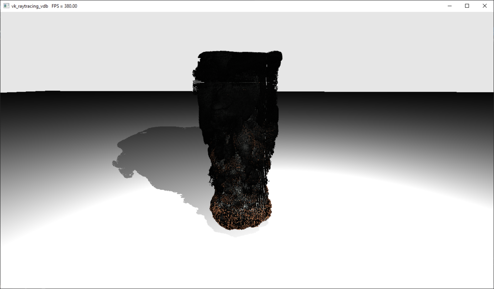
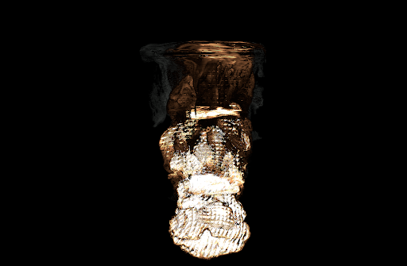
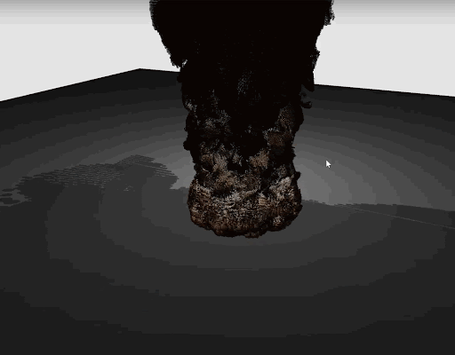
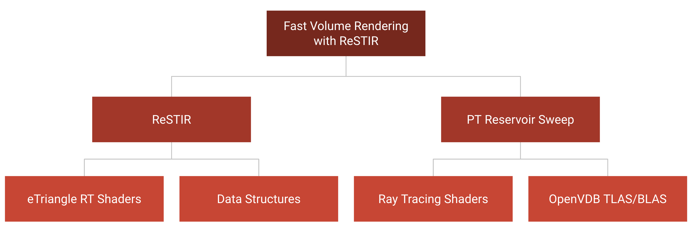

This is a project of a Vulkan implementation of Fast Volume Rendering with Spatiotemporal Reservoir Resampling. It achieves the following:

* Vulkan ray tracing pipeline with [nvpro](https://github.com/nvpro-samples/nvpro_core) and Vulkan Ray Tracing KHR extension.
* Volume assets loading and rendering through [OpenVDB](https://www.openvdb.org/).
* ReSTIR algorithm rendering on GLTF scene and volume assets.

### Authors

* Zhihao Ruan (ruanzh@seas.upenn.edu), Shubham Sharma (sshubh@seas.upenn.edu), Raymond Yang (rayyang@seas.upenn.edu)
* Tested on: Windows 10 Home 21H1 Build 19043.1288, Ryzen 7 3700X @ 3.59GHz 48GB, RTX 2060 Super 8GB

**This project requires an RTX-compatible (Vulkan Ray Tracing KHR-compatible) graphics card to run.**

### Demos

| Volume-ReSTIR  | Normal ReSTIR  |
| :------------: | :------------: |
|  |  |

| Ray Traced Volume Rendering (with OBJ Models) | Ray Traced  Volume Rendering |
| :-------------------------------------------: | :--------------------------: |
|                                 |                |

#### Rasterization vs. Path Tracing

|    Rasterization    |     Path Tracing     |
| :-----------------: | :------------------: |
|  |  |

#### ReSTIR

### Introduction

ReSTIR has been a very successful fast path tracing-based rendering algorithm in recent computer graphics. However, the current state-of-the-art ReSTIR algorithm only works with meshes. Moreover, there exists some common objects in the scene that are not suitable for mesh creation. VDB asset is a special kind of asset that compensates the drawback of meshes and provides a much more accurate description for volume-based objects, such as smokes, clouds, fire flames, etc. Therefore, it is of great importance to migrate current ReSTIR procedures on volume assets so that we could also render the smokes and clouds photo-realistically and efficiently.

#### VDB Data Structures

VDB is a special type of data structure for smokes, clouds, fire flames, etc. that is based on hierarchical voxel grids. It essentially holds a set of particles. It also uses a similar tree-like data structure as scene graphs for fast traversal and access that stores all transformations at intermediate nodes, and only the particle positions at leaf nodes.







#### ReSTIR Algorithm

*Source:*

* [*Spatiotemporal reservoir resampling for real-time ray tracing with dynamic direct lighting*](https://research.nvidia.com/sites/default/files/pubs/2020-07_Spatiotemporal-reservoir-resampling/ReSTIR.pdf)
* [*Fast Volume Rendering with Spatiotemporal Reservoir Resampling*](https://research.nvidia.com/publication/2021-11_Fast-Volume-Rendering)

ReSTIR algorithm is a special ray tracing-based rendering algorithm that deals with large number of light source efficiently. It takes advantage of alias tables for Resampled Importance Sampling (RIS) and flexible reservoir data structures. RIS effectively culls images of low weight lights and constructs a PDF (Probability Distribution Function) of lights for the scene. The reservoirs, allocated one for each pixel, map geometry collisions to light sources in the scene. The reservoirs are easily updated for every bounce, each time considering a candidate from a subset of all lights. If the candidate is chosen, the reservoir will map the geometry to the new light. As more samples are considered, it becomes less likely for any candidate to be placed into the reservoir. These reservoirs use a combination of probability and giving up precision to generate result pixel color such that the image converges in near real time.

#### Vulkan Ray Tracing

Vulkan is considered as the next-generation API for uniform graphics drivers. It is fast, efficient, light weight, but yet verbose. Vulkan users needs to explicitly set up every little details of the entire rendering pipeline, which is often quite problematic. In this project we provide an explicit example of setting up a working Vulkan rendering pipeline, and it generally involves the following procedures:

1. Set up [glfw](https://github.com/glfw/glfw) to work with the latest version of Vulkan.
2. Initialize Vulkan instance, Vulkan physical device, Vulkan logical device, Vulkan swapchain (for passing to frame buffer display), Vulkan graphics command queue.
3. Create all buffers to be passed to device memory. This includes: frame buffer, rendering pipeline description buffer, data buffer (primitive vertices, indices, normals, materials, textures, etc.).
4. Create descriptor set for all device buffers. Vulkan descriptor set defines the *stage* that GPU reads the data (either in vertex shader, fragment shader, or any stage in the ray tracing pipeline) and the *way* that GPU reads the data (either as uniform samplers, uniform images, storage buffers, uniform buffers, etc.).
5. Bind the data buffer with the corresponding descriptor set.
6. Create the graphics pipeline. Graphics pipelines are defined in `VkPipeline`, which specifies the actual procedures of an entire render pass. It can either be defined as a rasterization pipeline (vertex shader --> primitive assembly --> rasterization --> fragment shader), or a ray tracing pipeline (ray generation shader --> ray intersection shader --> ray closest hit shader/ray miss shader --> post processing fragment shader).
7. Get the current command buffer, prepare the frame, and run the pre-defined pipeline with all device buffers passing in using descriptor sets.

Vulkan does not render objects directly. Instead, it uses multiple command queues to queue all commands to be passed onto device. This is actually very similar to CUDA as CUDA also uses multiple streams to send commands to the GPU. That's why the graphics command queue comes in.

The ray tracing pipeline in Vulkan requires the usage of *Vulkan Acceleration structures*. The acceleration structure is divided into two levels to allow shared usage of geometry resources. For example, if you have a high poly model of sphere mesh formed with 30000 triangles, a great optimisation on the memory side would be to create the acceleration structure only once and transform it two detect intersection of rays with it.

The structure is stored in form of AABBs and can be controlled by

1. Bottom Level Acceleration Structure (BLAS) &mdash; Used for creating the the Axis Aligned bounding box for a geometry. Vulkan Provides built in feature to build the AABBs for the triangle primitives but we have to specify the AABBs ourselves for non primitive geometry such as Sphere in our case.
2. Top Level Acceleration structure &mdash; Points to an instance of BLAS, this allows easy transformations of an exisiting instance of BLAS across the scene.
Note - BLAS requires the AABBs to be passed as 4 bit floating point. So if you see any un intended behaviour do look at memory padding in C++.

It is generally very hard to set up a complete Vulkan rendering pipeline from the lowest-level Vulkan libraries. Nowadays, there have been many different styles of Vulkan libraries wrappers for cleaner code production. In this project we took the advantage of [nvpro](https://github.com/nvpro-samples/nvpro_core) to set up a clean Vulkan pipeline for us.

### References

1. Daqi Lin, Chris Wyman, Cem Yuksel. [Fast Volume Rendering with Spatiotemporal Reservoir Resampling](https://research.nvidia.com/publication/2021-11_Fast-Volume-Rendering). ACM Transactions on Graphics (Proceedings of SIGGRAPH Asia 2021), 40, 6, 2021.
2. Benedikt Bitterli, Chris Wyman, Matt Pharr, Peter Shirley, Aaron Lefohn, and Wojciech Jarosz. 2020. [Spatiotemporal reservoir resampling for real-time ray tracing with dynamic direct lighting.](https://research.nvidia.com/sites/default/files/pubs/2020-07_Spatiotemporal-reservoir-resampling/ReSTIR.pdf) <i>ACM Trans. Graph.</i> 39, 4, Article 148 (July 2020), 17 pages. DOI:<https://doi.org/10.1145/3386569.3392481>
3. [Volume Rendering](https://www.omnisci.com/technical-glossary/volume-rendering)
4. [Volume Rendering (Nvidia)](https://developer.nvidia.com/gpugems/gpugems/part-vi-beyond-triangles/chapter-39-volume-rendering-techniques)
5. [Ray Tracing Gems II](https://www.realtimerendering.com/raytracinggems/rtg2/index.html)
6. [Vulkan Ray Tracing Tutorial](https://developer.nvidia.com/rtx/raytracing/vkray)
7. [OpenVDB](https://www.openvdb.org/) for VDB data loading.
8. [nvpro](https://github.com/nvpro-samples/nvpro_core) for Vulkan Ray Tracing KHR setup.
9. [spdlog](https://github.com/gabime/spdlog) for fast C++ logging.
10. [nvpro-samples/vk_mini_path_tracer](https://github.com/nvpro-samples/vk_mini_path_tracer)
11. [nvpro-samples/vk_raytracing_tutorial_KHR](https://github.com/nvpro-samples/vk_raytracing_tutorial_KHR)
12. [dipmizu914/ReSTIR_on_Vulkan](https://github.com/dipmizu914/ReSTIR_on_Vulkan)
13. Common graphics utilities [glfw](https://github.com/glfw/glfw), [glm](https://github.com/g-truc/glm), [stb](https://github.com/nothings/stb). These are all included in the [nvpro](https://github.com/nvpro-samples/nvpro_core).
