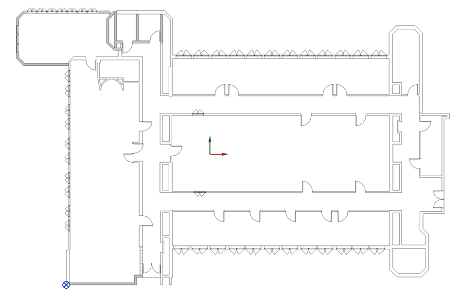
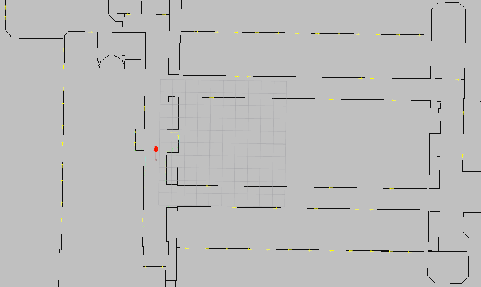
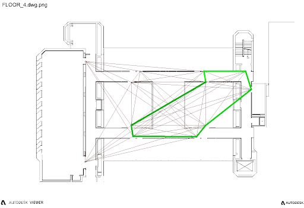
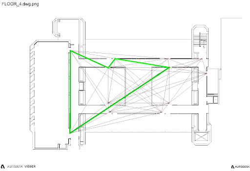
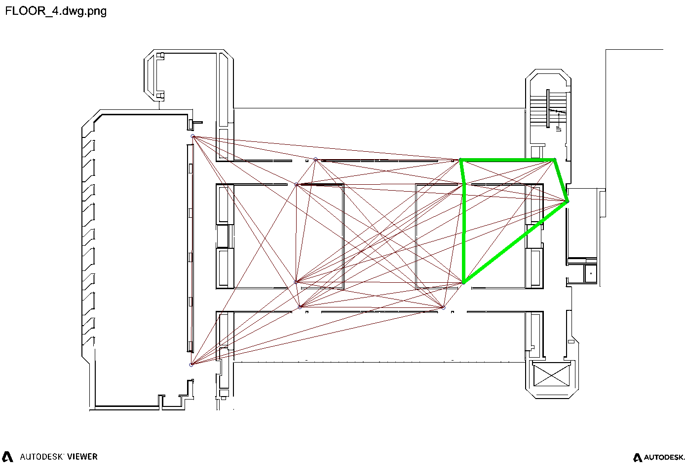
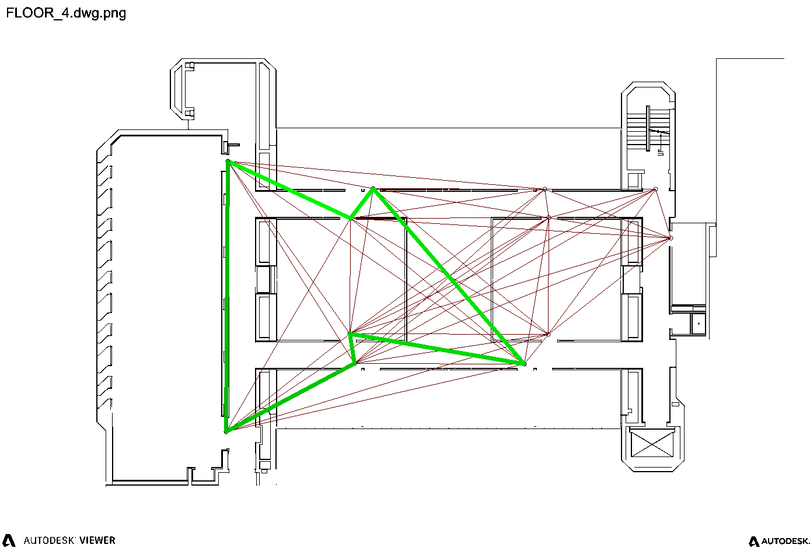
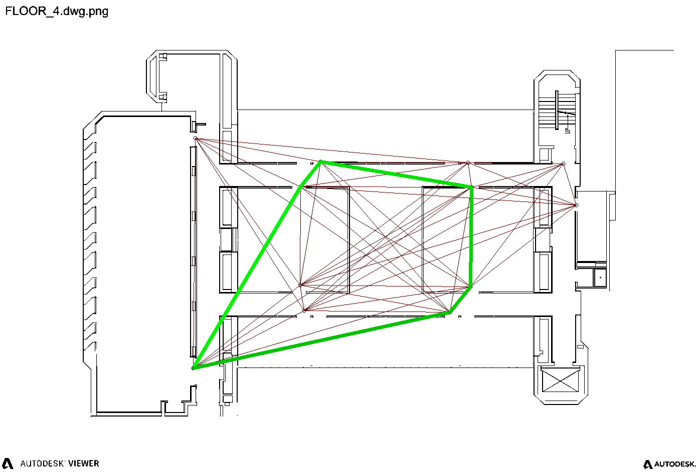
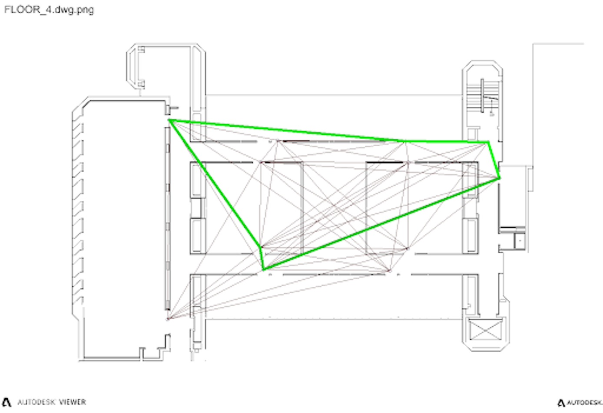

CAD2CAV is a project focusing on multi-agent exploration in unknown environments. It attempts to build a complete system from perception to planning and control, exploring a designated unknown environments with multiple autonomous vehicles. It is built in [xLab at the University of Pennsylvania](https://mlab-upenn.github.io/lab_website/), on multiple [F1TENTH race cars](https://f1tenth.readthedocs.io/en/latest/). 

Useful documents:
* [GitHub link](https://github.com/mlab-upenn/ISP2021-cad2cav)
* [Spring 2021 Final Report (not complete)](/files/CAD2CAV_Project_Report.pdf)

## Demo
This is a sample scenario of a single F1TENTH race car exploring the 2nd floor of Levine Hall at the University of Pennsylvania, right outside xLab.



## Motivation
Autonomous robots have been widely used in a great number of aspects in our daily life. Specifically, mobile robots have demonstrated great help in unknown environment exploration, i.e., rescue robots exploring debris of a building after an earthquake, scientific robots exploring the world under the sea, etc. We are particularly interested in developing a fleet of mobile robots based on the dynamics of a normal self-driving vehicle (i.e., F1TENTH race cars) that helps people explore normal in-use buildings, or buildings that are still under construction. 



Normally, one would quickly think of SLAM (Simultaneous Localization and Mapping) when it comes to robotic exploration (for more details, see my [SLAM project]()). Yes, that is one of the most straightforward and simplest solution for a normal robotic exploration task. However, under the assumption of exploring a known building, we are actually given the access an extra layer of structural information for the target environment, i.e. the *floor plan* of the building. How to exploit that information and set up a multi-agent exploration task efficiently? That becomes the main goal for this project.

## Technical Details
### Overview
The general structure of this project is divided into 3 modules: a central ROS server, a building renderer/simulator, and the F1TENTH race car onboard computing platform. 



The figure above demonstrates the general relationship among the 3 modules. Given the prior knowledge of the building's floor plan (which is assumed to come from [Autodesk Revit](https://www.autodesk.com/products/revit/overview?term=1-YEAR&tab=subscription)), the building renderer would parse and construct a rendered 3D model our of it for visualization; the central ROS server would extract necessary structural information and construct 2D occupancy map for motion planning & mapping nodes. As soon as the central ROS server generates a balanced multi-agent routing scheme, it would pass the plan to each F1TENTH race car and the race car would then execute the drive node to drive the car and follow the high-level routing scheme in the real world. 

As the race car is driving in the environment, its perception module would try to localize itself in the occupancy map and update the perceived objects in the map. The map then gets updated in the central ROS server and the server would also pass the updated map to the building renderer. The building renderer would finally render everything and visualize the building in the software.

### Building Renderer
As mentioned above, we need a building renderer to render 3D models and visualize everything on the screen. Our current choice is to use Unreal Engine 4. UE4 has a popular plugin called Unreal Datasmith compatible with most of the mainstream model designing softwares, i.e., Autodesk Revit, Cinema 4D (C4D), Rhino, etc. 

Users can install and try the plugin by following the tutorial of [Exporting Datasmith Content from Revit](https://docs.unrealengine.com/4.27/en-US/WorkingWithContent/Importing/Datasmith/SoftwareInteropGuides/Revit/ExportingDatasmithContentfromRevit/) and [Importing Datasmith Content into Unreal Engine 4](https://docs.unrealengine.com/4.27/en-US/WorkingWithContent/Importing/Datasmith/HowTo/ImportingContent/). We also hosted a pre-imported model of Levine Hall 4th floor on [GitHub](https://github.com/shineyruan/unreal_levine_4).



#### Other Options
We are also looking into trying out different options that are more friendly to robotics application development than UE4. One of them is the [Nvidia Isaac Sim](https://developer.nvidia.com/isaac-sim) powered by the newly-announced Nvidia Omniverse platform. 

### Central ROS Server
The central ROS server is responsible for: 1) parsing floor plan from Revit and constructing initial occupancy grid; 2) generating high-level balanced multi-agent routing scheme from occupancy map; 3) updating occupancy map from the perception data; 4) sending occupancy map information over to building renderer. Each of these tasks is a sub-problem in different fields of robotics, in the general sense.

#### Initial Map Construction from Revit
Revit models are encoded in a unique format special to the software. Hence, the only way for us to extract information from a general Revit model is through the [Revit API](https://www.revitapidocs.com/2022/). Revit API is initially written in C\#, while it has been recently transferred to Python by an open-source project called [pyRevit](https://github.com/eirannejad/pyRevit). By following the official installation tutorials of pyRevit, I have managed to create a pyRevit plugin for the project to specifically export the 2D geometry information of all the main elements in a building floor plan. The current supported elements and their geometric representations are:
1. Walls, represented as 2D line segments;
2. Doors, represented as 2D points with orientation;
3. Windows, represented as 2D points with orientation.

The current pyRevit plugin is hosted on [GitHub](https://github.com/shineyruan/cad2cav_revit_plugins) and is written in IronPython 2.7.[^1] It runs in Autodesk Revit 2022. Upon one button click, it would try to look for these elements in the model and print their geometric representation information in the console with the following specific format:

[^1]: [IronPython](https://ironpython.net/) is the Python extension for Microsoft .Net environment. It is used by pyRevit as the default Python wrapper over C\# Revit API.

```txt

Type,x_1,y_1,z_1,x_2,y_2,z_2,Orientation,Width,Height
wall,-17.3718,12.2507,0.0,-16.7919,12.8305,0.0,0.0,0.0,0.0
door,-6.2356,2.5174,0.0,0.0,0.0,0.0,1.5708,0.864,2.032
window,-0.915,-3.4125,0.9,0.0,0.0,0.0,3.1416,1.05,1.35

```

Users are supposed to save the console outputs into a CSV file and put it manually in the ROS codebase. 

In the CSV format: 
- `Type` is a string describing the object type; 
- `x_1`, `y_1`, `z_1` is the 3D Cartesian coordinate of the 1<sup>st</sup> endpoint of the line segment, or the position of the oriented point; 
- `x_2`, `y_2`, `z_2` is the 3D Cartesian coordinate of the 2<sup>nd</sup> endpoint of the line segment, or left blank if the type is an oriented point; 
- `Orientation` is the orientation of the point, or left blank if the type is a line segment; 
- `Width` and `Height` are the actual width and height of the doors and windows in the Revit model, and are left blank for the walls.



After we have the necessary structural information in a floor plan contained in a CSV file, we can then proceed to load the file in ROS and construct an initial occupancy map out of it. Since all information are transformed into some basic geometric shapes, it is then very easy for us to draw these shapes on a 2D grid. The only algorithm we use here is the [Bresenham's line algorithm](https://en.wikipedia.org/wiki/Bresenham%27s_line_algorithm), which enables fast grid marching along a certain 2D line segment. We set everything cell in the grid that is part of the geometric shapes to be `OCCUPIED` and an initial map for the floor plan is then produced.

|              Revit               |         Occupancy Grid         |
| :------------------------------: | :----------------------------: |
|  |  |

#### Waypoint Identification and Registration
To generate a high-level routing scheme for multiple vehicles to explore, it is important to know which set of locations or areas that the exploration needs to cover. While we're still exploring other options[^2], for simplicity we provide an interface for users to select and register waypoints on the map in a pop-up window. As soon as the waypoints are registered, the server would construct a graph out of all the waypoints, and the routing algorithms will be performed with the scope of an abstract graph.

[^2]: Other options include the algorithm of extracting a Voronoi skeleton out of a general occupancy map. This work was initially proposed by Lau et al. in the IROS 2010 paper ["Improved updating of euclidean distance maps and Voronoi diagrams"](http://ais.informatik.uni-freiburg.de/publications/papers/lau10iros.pdf).



#### Graph Planning and Routing
All the high-level routing algorithms are conducted on an abstract graph. In this task we're interested in assign an exploration route for each vehicle, such that all vehicles gets an exploration path of equal or similar cost to each other. 

##### The Capacitated Vehicle Routing Problem (CVRP)
Vehicle Routing Problem (VRP) is a famous set of combinatorial optimization problems widely used in operations research. It is essentially a generalization to the famous Travelling Salesman Problem (TSP), which only focuses on computing the cheapest transportation loop for one single agent. The VRP can be described as the following:[^3]

[^3]: From Wikipedia: [Vehicle Routing Problem](https://en.wikipedia.org/wiki/Vehicle_routing_problem).

> Concerning the service of a delivery company. Things are delivered from one or more *depots* which has a given set of home *vehicles* and operated by a set of *drivers* who can move on a given *road network* to a set of *customers*. Determine the set of *routes* (one route for each vehicle that must start and finish at its own depot) such that all customers' requirements and operational constraints are satisfied and the *global transportation cost* is minimized.

From an optimization problem point of view, VRP essentially tries to minimize the transportation cost under some constraints. Notice that VRP itself does not specify any definition for the transportation costs in the first place. Here we choose to minimize the Euclidean distance as the objective function. The original VRP problem does not specify any constraints either. However, as the optimal solution for an unconstrained VRP would fall back to a TSP loop which is meaningless for our project, we introduce a capacity constraint on each vehicle, which forms the Capacitated VRP (CVRP) problem:

> Each vehicle has a fixed *capacity* defining the maximum number of nodes it could visit in one run. Once the vehicle has visited the maximum number of nodes after it leaves the depot, it must return to the depot immediately.

The formulation of CVRP in our project would be simply minimizing the total Euclidean distance of the set of routes over the graph of waypoints in Revit coordinates. By tuning the capacity of the vehicle as a hyperparameter, we are able to generate a set of routes that covers all waypoints and minimizes the total travelled distance in the same time, for a fixed number of vehicles. 

Solving the CVRP problem in our project involves the use of [Any Colony Optimization](https://en.wikipedia.org/wiki/Ant_colony_optimization_algorithms) (ACO) algorithm. As the general CVRP problem is NP-hard, ACO is used as an approximation to the optimal solution that runs in polynomial time. 

A general description of ACO algorithm can be described in the pseudo-code:
```python
procedure ACO_MetaHeuristic is
    while not terminated do
        generateSolutions()
        daemonActions()
        pheromoneUpdate()
    repeat
end procedure
```

The essence of ACO is to mimic a colony of exploring ants. During exploration, each ant would leave a pheromone trail behind its body, and other ants would smell it and intend to follow the path of the previous ants. Meanwhile, each ant also has an intention of exploring unvisited places. The combination of two different intentions forms an [$\varepsilon$-greedy strategy](https://www.geeksforgeeks.org/epsilon-greedy-algorithm-in-reinforcement-learning/) for each ant, balancing exploration with exploitation.

Our implementation of ACO algorithm also involves a timeout variable for terminating the while loop, generating graph search solutions for each ant, determining the next action for the current ant, and updating the pheromone trails. Notice that in any CVRP solution, all vehicles must start off from one common depot.

| CVRP Solution for Vehicle 1 | CVRP Solution for Vehicle 2 |
| :-------------------------: | :-------------------------: |
|               |               |

##### Spectral Clustering
Another way to tackle this multi-agent routing task is to divide the entire graph into several partitions. In each partition, we find a TSP path that connects all nodes in the subgraph and minimizes the travel cost. **The advantage of this method is that vehicles are *not* required to start off from one common depot anymore, which makes the algorithm suitable for replanning at any time during the exploration.**

Spectral clustering is an intuitive way to group graph nodes together based on spectral coordinates. This algorithm initially comes from the theory of unsupervised learning. The spectral coordinates of a graph is defined to be the row vectors of the eigenvector matrix of the Laplacian of the graph. We can obtain the spectral coordinates for each graph node in the following way:
1. Construct an adjacency matrix $W$ for the graph;
2. Compute the degree matrix $D$ by summing up all elements per row of $W$ and make it a diagonal matrix.
3. Compute the graph Laplacian $L$ by $L=D-W$.
4. Compute the eigenvalues and eigenvectors of $L$, sort them in ascending order.
5. The spectral coordinates of each graph node is the corresponding row of the eigenvector matrix of $L$.



After obtaining the spectral coordinates for each node, we then apply a simple clustering algorithm on the spectral space of the nodes. One popular choice would be [k-means clustering](https://en.wikipedia.org/wiki/K-means_clustering). As for us, we replaced k-means with [k-means++](https://en.wikipedia.org/wiki/K-means%2B%2B) as a quick and simple improvement, which improves the initialization of the centroids to make the clustering outcome more stable.

Spectral clustering tends to group similar nodes together. The definition of similarity lies in the definition of the weight of the edges. That is, the lower the edge weight is between two nodes, the higher chances that they are grouped together. This property of spectral clustering aligns perfectly with our desire, i.e., nodes in the neighborhood form a subpart of the graph. Hence, we could directly apply spectral clustering to our graph partitioning task and generate TSP loop within each graph partition.

The application of spectral clustering implicitly assume that the graph is complete, i.e., every two nodes are connected. Hence, it cannot generalize to all situations, especially those incomplete graphs generated from some special floor plans. 

| Spectral Clustering for Vehicle 1 | Spectral Clustering for Vehicle 2 |
| :-------------------------------: | :-------------------------------: |
|                |                |

##### Multi-level $k$-Way Graph Partitioning
Another way of partitioning the graph is to formulate a $k$-way graph partitioning problem. Traditional graph partitioning problems aims to find a minimum cut to divide the graph subject to the constraint that all resulting subparts are as evenly partitioned as possible. One handy multi-level $k$-way partitioning algorithm[^4] for this builds upon the [Kernighan-Lin heuristic](https://en.wikipedia.org/wiki/Kernighan%E2%80%93Lin_algorithm). For simplicity, we directly incorporated [METIS](http://glaros.dtc.umn.edu/gkhome/metis/metis/overview) to perform the graph partitioning task. We then generate TSP loops in each graph subpart using [Google OR-Tools](https://developers.google.com/optimization).

[^4]: See [METIS](http://glaros.dtc.umn.edu/gkhome/metis/metis/overview) and ["Multilevel k-way partitioning scheme for irregular graphs"](https://www.sciencedirect.com/science/article/pii/S0743731597914040).

| $k$-Way Graph Partitioning for Vehicle 1 | $k$-Way Graph Partitioning for Vehicle 2 |
| :--------------------------------------: | :--------------------------------------: |
|                   |                   |

##### Graph Planning Summary and Demo
We explored 3 different ways of distributing different routes to each vehicles based on abstract graphs in the graph planning task in our project. One of them requires a common starting point (initial depot) and the others are based on graph partitioning. All of these methods tries to find a set of routes that covers all the floor plan with minimum overlap and complete loops. Although we have implemented all 3 methods in our code base, our default and most up-to-date choice would be the application of METIS and multi-level $k$-way partitioning algorithm.



### F1TENTH Onboard Computing Platform
The latest version of F1TENTH race car is equipped with a nice Nvidia Xavier NX Development Board as the onboard computing platform, which contains both an ARMv8 CPU and a CUDA-enabled GPU. It runs a complete but special Ubuntu system developed and shipped by Nvidia. In general, it is capable of performing part of the computationally heavy tasks in our project. In our design, we run the low-level planning and control node as well as the localization and mapping node onboard. 

#### Obstacle-Avoiding Planning and Control
After we have a complete route for each vehicle, we need to design an algorithm for the vehicle to actually reach those waypoints in the real world. Hence, the algorithm is required to be fast, accurate, and responsive. In this task, we choose to apply the [Fast Marching Tree (FMT*)](https://arxiv.org/abs/1306.3532) algorithm as a low-level planner to generate real-time trajectories for each vehicle. As a sampling-based planning algorithm, FMT* is fast enough to replan in a very short amount of time so that the vehicle is able to avoid obstacles. 

As a general overview, FMT* combines the properties of two different sampling-based planning categories: [PRM (Probabilistic Road Map)](https://en.wikipedia.org/wiki/Probabilistic_roadmap) and [RRT (Rapidly-exploring Random Trees)](https://en.wikipedia.org/wiki/Rapidly-exploring_random_tree). It first samples a set of points from the planning space (or configuration space), and tries to grow a tree from the start to the end in an RRT-style. It defines an unvisited set $V_\text{unvisited}$, an open set $V_\text{open}$ and a closed set $V_\text{closed}$. As the following figure shows, it involves the following steps:
1. Add the starting point to $V_\text{closed}$.
2. Add all of the neighboring points of the starting point to $V_\text{open}$. All the other points are in $V_\text{unvisited}$.
3. Select the lowest cost node $z\in V_\text{open}$ and finds its neighbors $\mathcal{N}(z)\subseteq V_\text{unvisited}$.
4. Given a node $x\in\mathcal{N}(z)$, find the optimal 1-step connection to its neighboring nodes $\mathcal{N}(x)$ in $V_\text{open}$.
5. Check collision on all newly-added connections and apply penalties for violations (i.e., remove all the collision connections);
6. Add all successful connected nodes to $V_\text{open}$, and move $z$ to $V_\text{closed}$.
7. Repeat the operations from Step 3 until the goal is reached. 



FMT* works as a low-level planner on the vehicle and generates trajectory towards the next waypoint in the high-level route. For now, the trajectory consists of a set of more fine-grained 2D points. For future work orientation can be added to the trajectory point as an extra information so that the vehicle could be better controlled in terms of steering.

As for the control algorithm, we currently run the traditional pure-pursuit algorithm to drive the vehicle to follow the trajectory points. For a more detailed overview of the pure-pursuit algorithm please checkout [my F1TENTH Lab 6 report]().

Future work on the control algorithm involves developing a [model predictive control (MPC)](https://en.wikipedia.org/wiki/Model_predictive_control) algorithm, but for the sake of simplicity we still stick to pure-pursuit for the moment. 



#### Localization
In a real-world experiment, each vehicle needs to know where it is in the map. Hence, it is very important for the vehicle to have a localization module onboard. Common localization algorithms in general robotics include all kinds of filtering algorithms, from Bayes filer, [Kalman filter (KF)](https://en.wikipedia.org/wiki/Kalman_filter) and its variations ([EKF](https://en.wikipedia.org/wiki/Extended_Kalman_filter), [UKF](https://groups.seas.harvard.edu/courses/cs281/papers/unscented.pdf), etc.), and [particle filter](https://en.wikipedia.org/wiki/Particle_filter). We choose to use particle filter as a starting point and incorporated a CUDA-accelerated package of particle filter[^5] from the MIT race car team.

[^5]: See [mit-racecar/particle_filter](https://github.com/mit-racecar/particle_filter).



##### Localization with Landmarks
However, there will still be large errors in the results of localization if we only use the plain version of particle filter. The errors mainly comes from the fact that it is difficult to localize a robot with great accuracy in a *plain straight hallway*. As we have already got access to the floor plan of the building in advance, we can actually utilize this layer of information and incorporate the perception of the doors and windows from the vehicle to improve its localization results. These doors and windows will be called *landmarks*. We refer to the [Semantic SLAM paper](https://www.cis.upenn.edu/~kostas/mypub.dir/bowman17icra.pdf) for an algorithmic overview of incorporating landmarks into the particle filter localization. 

Thanks to my project partner Shumin for her work on the localization module and please checkout [Shumin's post](https://shumin326.github.io/shumin.github.io/jekyll/update/2021/12/21/IndependentStudy.html) for more details on the particle filter development. 



#### Object Detection
In order to perceive landmark information, we need to perform object detection and 3D pose estimation. An easy implementation of object detection would be simply applying a [YOLO model](https://pjreddie.com/darknet/yolo/). We also provided a ground truth object detection package through [AprilTag 3](https://april.eecs.umich.edu/software/apriltag#:~:text=AprilTag%20is%20a%20visual%20fiducial,tags%20relative%20to%20the%20camera.). In our experiment, tags of family `Tag36h11` with a size of 16.8cm were used. 

For more details on AprilTag implementation, please checkout [shineyruan/cad2cav_onboard](https://github.com/shineyruan/cad2cav_onboard). The YOLO object detection was also fine tuned and written in [Shumin326/darknet_ros](https://github.com/Shumin326/darknet_ros).



## References
* [eirannejad/pyRevit](https://github.com/eirannejad/pyRevit).
* [mit-racecar/particle_filter](https://github.com/mit-racecar/particle_filter).
* [google/or-tools](https://github.com/google/or-tools).
* [AprilRobotics/apriltag](https://github.com/AprilRobotics/apriltag).
* [ben-strasser/fast-cpp-csv-parser](https://github.com/ben-strasser/fast-cpp-csv-parser).
* [leggedrobotics/darknet_ros](https://github.com/leggedrobotics/darknet_ros).
* A. Y. Ng, M. I. Jordan, and Y. Weiss, "On spectral clustering: Analysis and an algorithm," in Proceedings of the 14th International Conference on Neural Information Processing Systems: Natural and Synthetic, ser. NIPS’01. Cambridge, MA, USA: MIT Press, 2001, p. 849–856.
* B. Lau, C. Sprunk, and W. Burgard, "Improved updating of euclidean distance maps and Voronoi diagrams," in Proceedings of the IEEE/RSJ International Conference on Intelligent Robots and Systems, Taipei, Taiwan, 2010. [Online]. Available: http://ais.informatik.uni-freiburg.de/publications/papers/lau10iros.pdf
* B. W. Kernighan and S. Lin, "An efficient heuristic procedure for partitioning graphs," The Bell System Technical Journal, vol. 49, no. 2, pp. 291–307, 1970.
* C. Johnson, "Topological mapping and navigation in real-world environments," Ph.D. dissertation, University of Michigan, 2018. Available: https://deepblue.lib.umich.edu/handle/2027.42/144014
* D. Arthur and S. Vassilvitskii, "K-means++: The advantages of careful seeding," in Proceedings of the Eighteenth Annual ACM-SIAM Symposium on Discrete Algorithms, ser. SODA ’07. USA: Society for Industrial and Applied Mathematics, 2007, p. 1027–1035.
* E. Olson, "AprilTag: A robust and flexible visual fiducial system," 2011 IEEE International Conference on Robotics and Automation, 2011, pp. 3400-3407, doi: 10.1109/ICRA.2011.5979561.
* G. Karypis and V. Kumar, "Multilevel k-way partitioning scheme for irregular graphs," Journal of Parallel and Distributed Computing, vol. 48, no. 1, pp. 96–129, 1998. [Online]. Available: https://www.sciencedirect.com/science/article/pii/S0743731597914040
* J. Wang and E. Olson, "AprilTag 2: Efficient and robust fiducial detection," 2016 IEEE/RSJ International Conference on Intelligent Robots and Systems (IROS), 2016, pp. 4193-4198, doi: 10.1109/IROS.2016.7759617.
* L. Janson, E. Schmerling, A. Clark, and M. Pavone, "Fast marching tree: a fast marching sampling-based method for optimal motion planning in many dimensions," 2015.
* S. L. Bowman, N. Atanasov, K. Daniilidis and G. J. Pappas, "Probabilistic data association for semantic SLAM," 2017 IEEE International Conference on Robotics and Automation (ICRA), 2017, pp. 1722-1729, doi: 10.1109/ICRA.2017.7989203.
* Yang, Zhong & Yao, Baozhen. (2009). "An Improved Ant Colony Optimization for Vehicle Routing Problem." European Journal of Operational Research. 196. 171-176. 10.1016/j.ejor.2008.02.028. 

