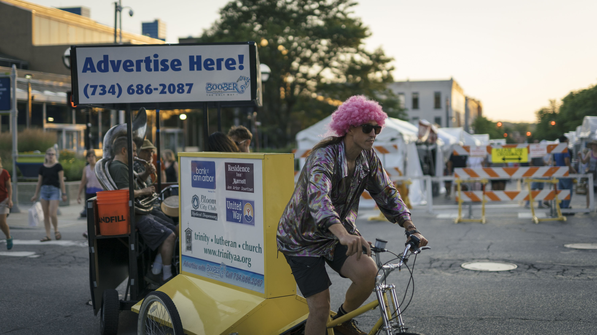
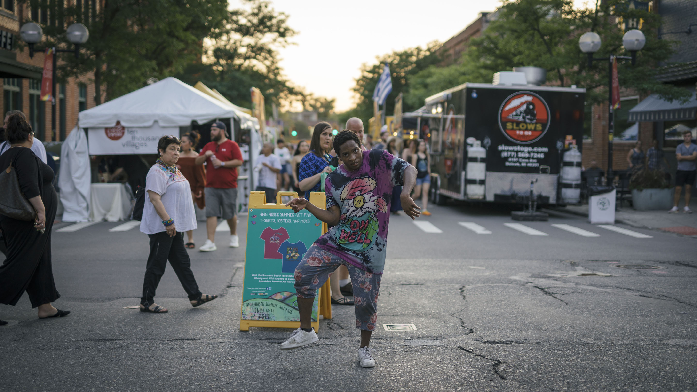

Ann Arbor is the place for me to pursue my second bachelor's degree in the University of Michigan. It is a small but lovely town located in the south of the State of Michigan. While I was taking classes and working on the campus, I would also like to record those tiny little pieces of happiness in daily life with my lenses. These pictures help to keep my precious memories.

<!-- more -->

## Story of My Daily Life

. Every time it arrives, it basically tells me I'am finally able to go home.")

## Ann Arbor Summer Festival

It was really wonderful for me to find that, during the summer, the town of Ann Arbor was getting more and more busy. One of the major activities in Ann Arbor in summer is the Summer Festival, in which a lot of artists and artisans would come and show off their great works. With excitement, I went to the festival, and received lots of great memories.

## Força, Barça

In August, FC Barcelona came to Michigan Stadium and had a match with S.S.C. Napoli. Why having a soccer match at Michigan? I would say, it was definitely because Michigan Stadium is the largest stadium in the US, the third largest stadium across the world! Although it was not an important match for the two soccer clubs, it was still really exciting. With no surprise, FC Barcelona finally won the game.

## "Blue Hour" in Ann Arbor

As I always finish my classes in the late afternoon, witnessing the beauty of the blue hour every day has been one of my favorite things. When the summer comes and the sky becomes clear, I finally got some chance to capture the romantic feelings in the blue hour.

