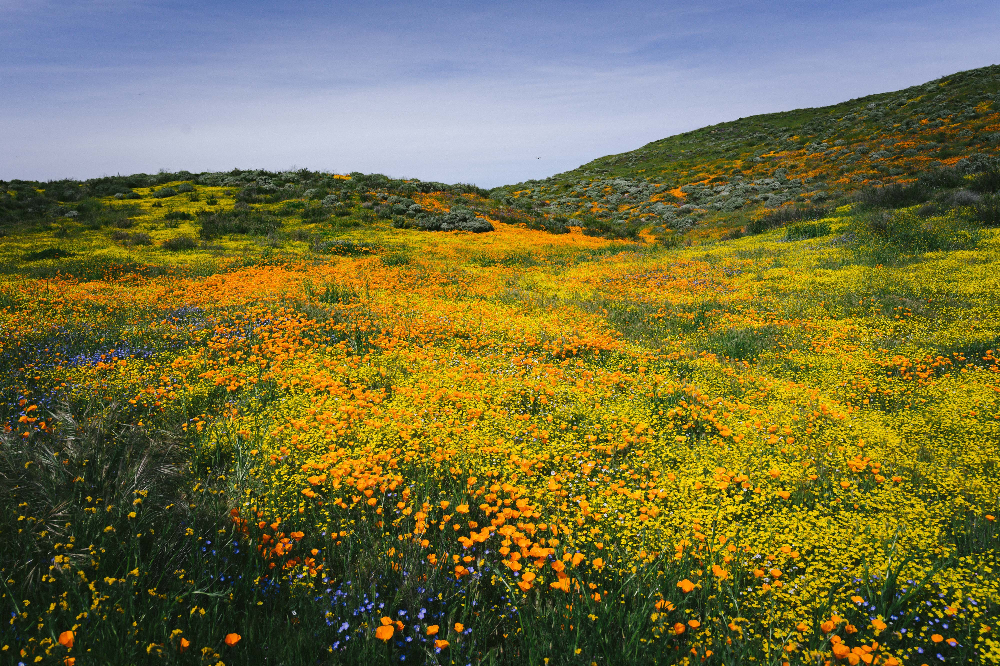
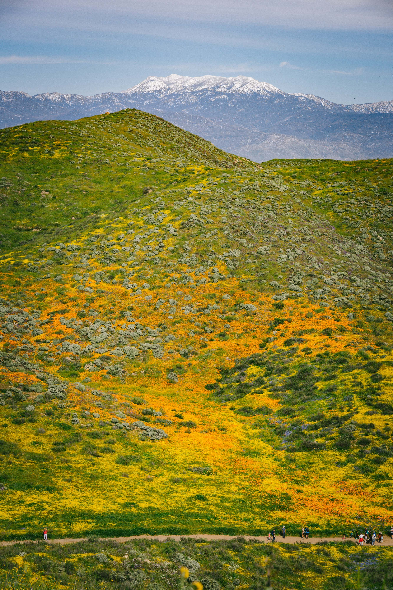
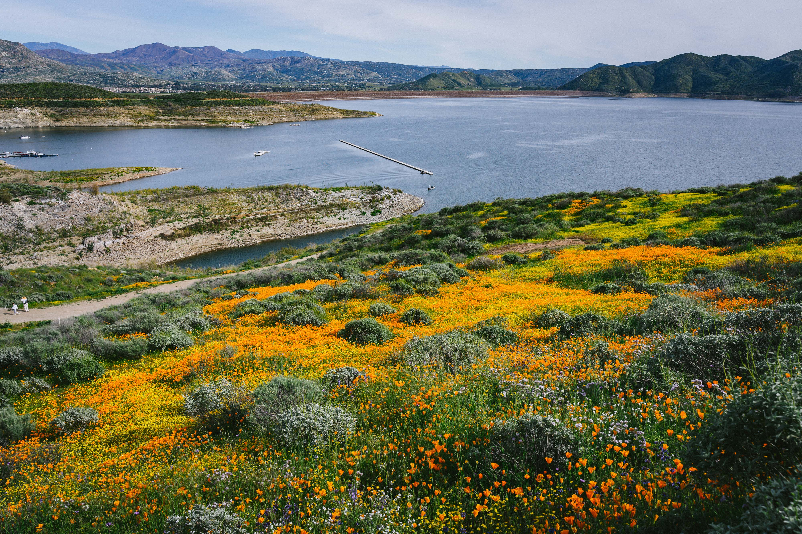
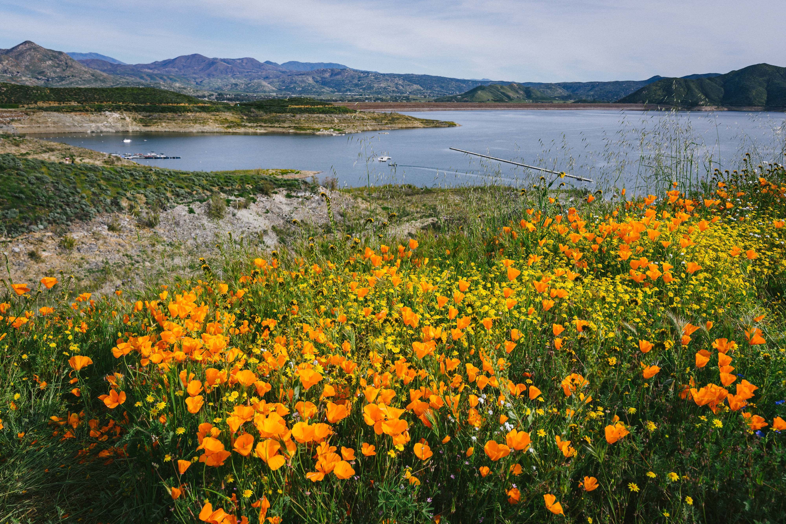
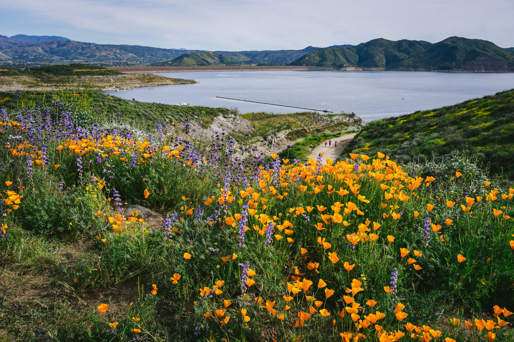

The winter of 2022--2023 has been an extremely wet one for California. The cold air from the North Pole rages down into the southern part of U.S. west coast, turning into heavy rain and snow. However, as a positive result, California is very likely to greet a splendid "[super bloom](https://secretlosangeles.com/california-superbloom/)" after several years of drought.

Of all the flowers, [California Poppy](https://en.wikipedia.org/wiki/Eschscholzia_californica) could be one of the most iconic flower species that worth a visit. It grows only in the State of California (and probably in Baja California as well!) and has been recognized as the official state flower of California.

In the Spring of 2023, I took my camera and enjoyed the beauty of California poppy in the wild.

