Last summer, I went to Ireland for a trip. As a fan of the Irish boy band Westlife, I was really lucky to be able to get a ticket to their concert at Croke Park in Dublin. Meanwhile, I also had a chance to explore Dublin, a city with bars and Irish folk music.

<!-- more -->

## Street Performers in Downtown Dublin

To my great surprise, street performing seems to be a very popular activity in Dublin. Walking in the streets in the city you could find a lot of street performers playing all kinds of musical instruments. Most of them are performing with great passion and happiness, as if they were just playing music on the street not for their living, but for fun.

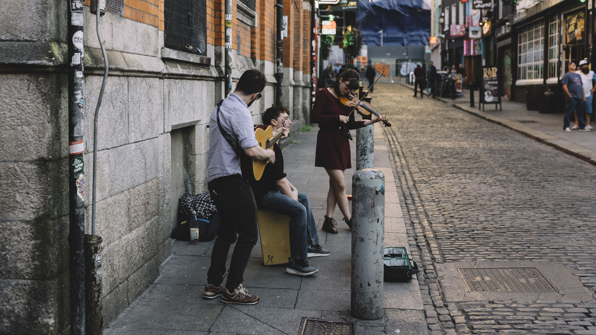

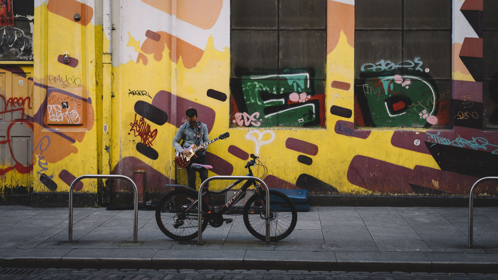

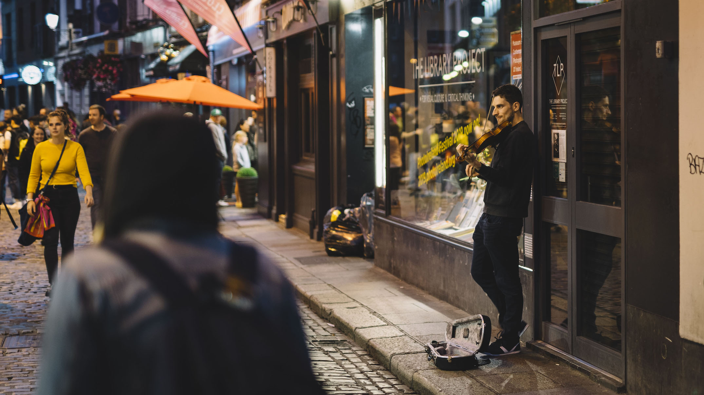

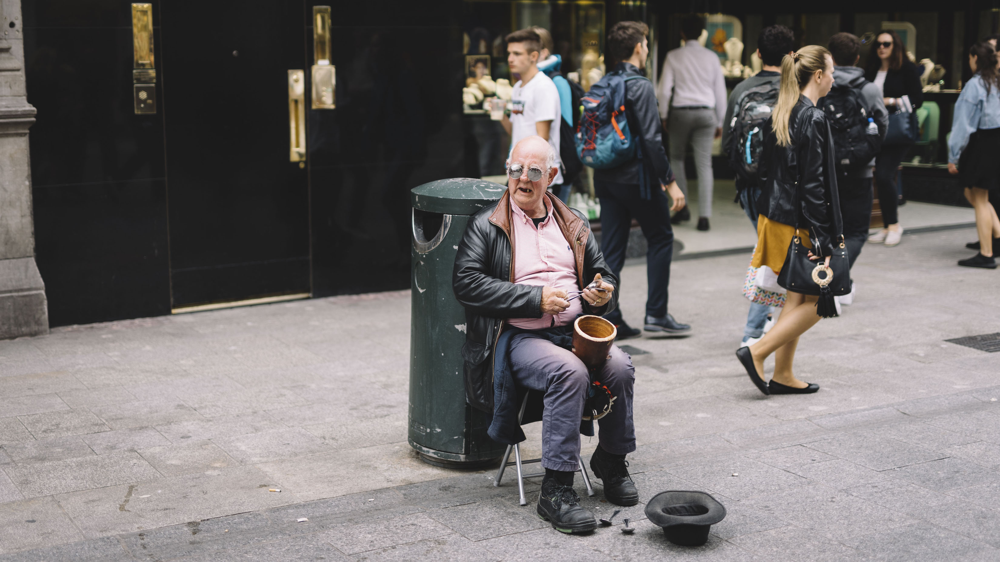

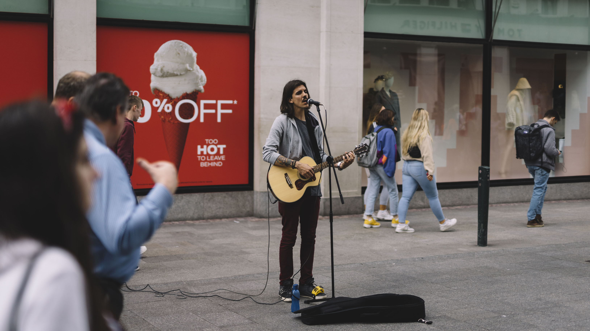

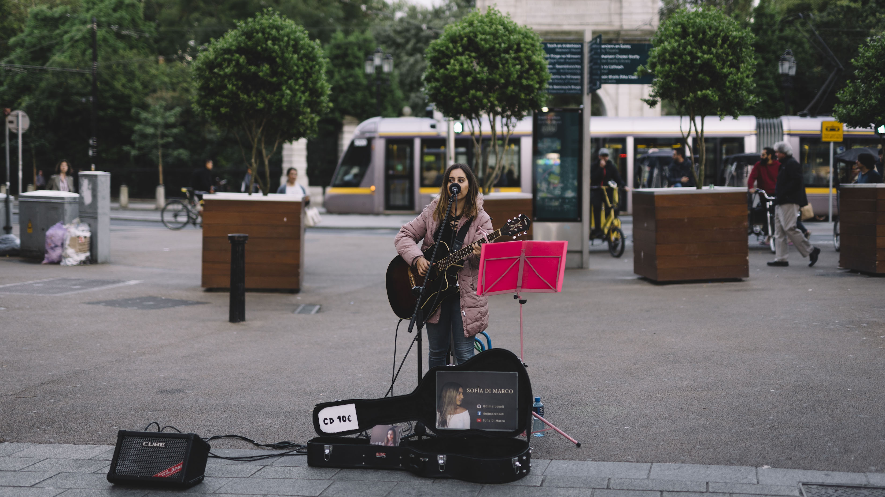

## Westlife "The Twenty Tour" @Croke Park, Dublin

"The Twenty Tour" is one of the major concert tours of Westlife after their reunion. I could hardly find a proper word to describe my excitement at the concert due to my poor vocabulary. It was really exciting, magnificent, and wonderful.

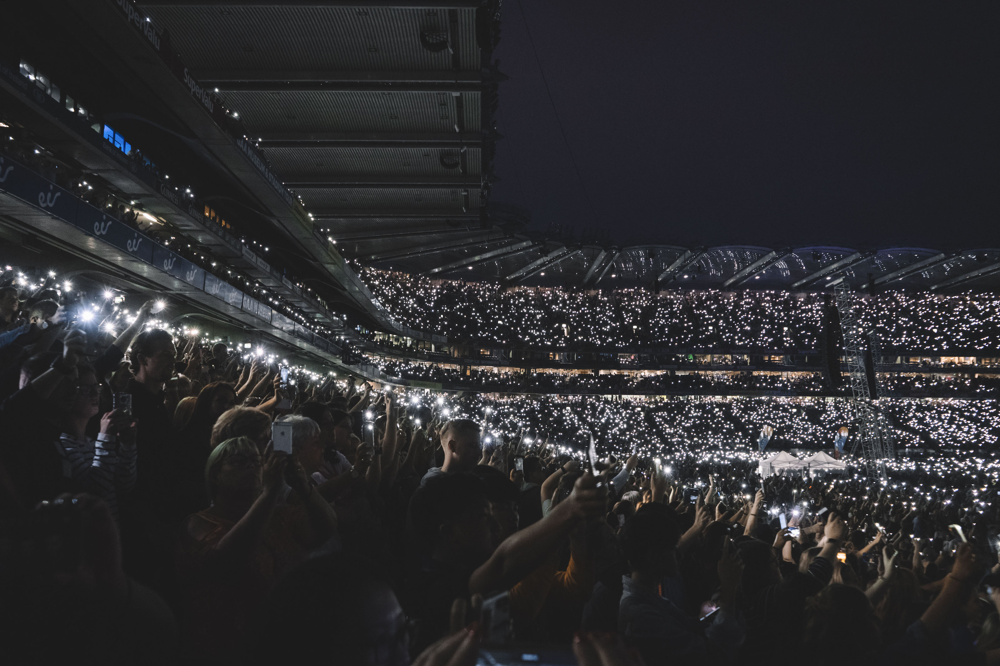

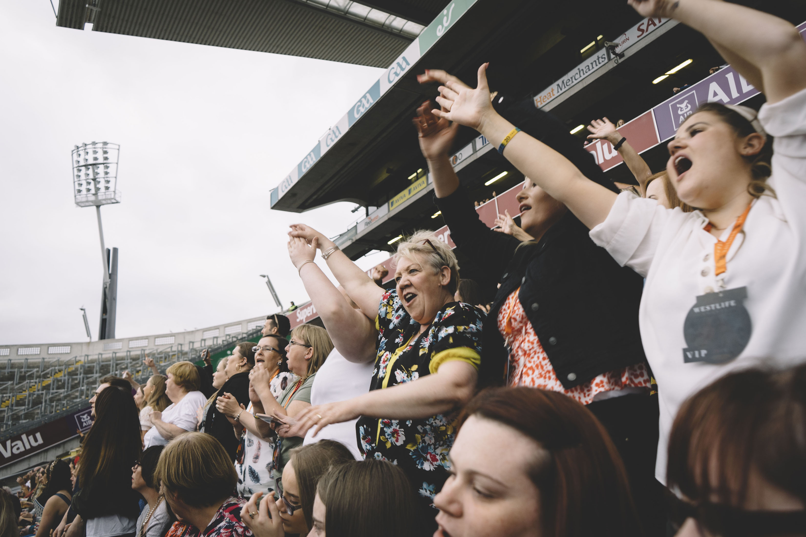

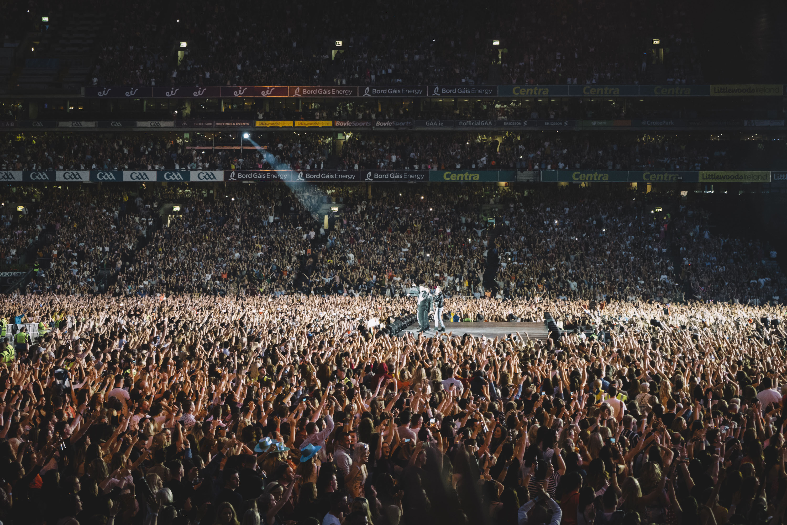

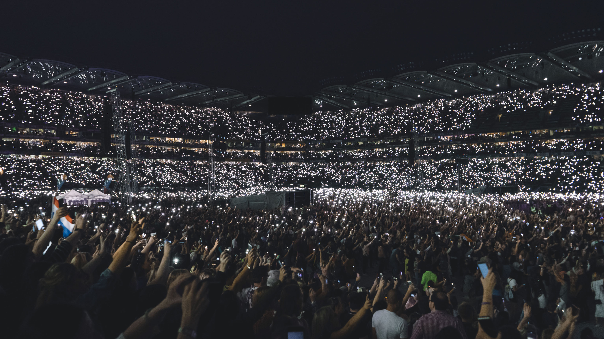

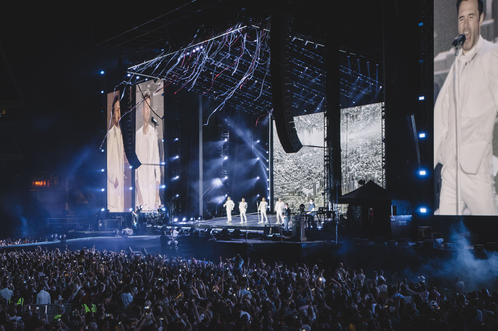

## Cork

Along with Dublin, I also visited the second-largest city in Ireland, Cork, and the famous Cliffs of Moher, during my trip to Ireland last summer.

Although Cork has been the second largest city of Ireland, it is still relatively small and looks more like a peaceful town. In Cork there is a famous English market where all kinds of Atlantic seefood, meat, fruits, and flowers are sold. The city was small but really peaceful, with a small river passing through the city center.

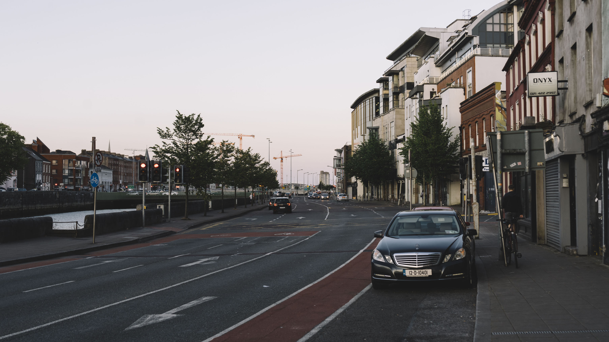

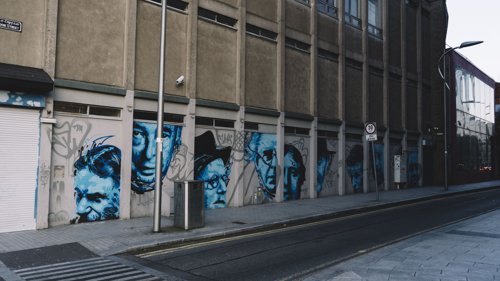

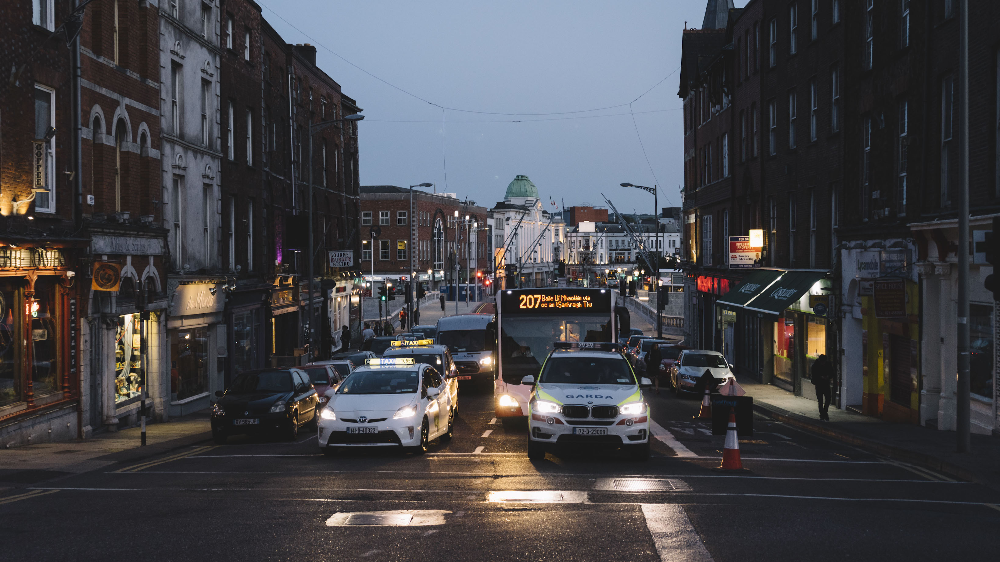

## Cliffs of Moher

Cliffs of Moher faces towards the great Atlantic Ocean. It is a wonderful place with magnificent views.

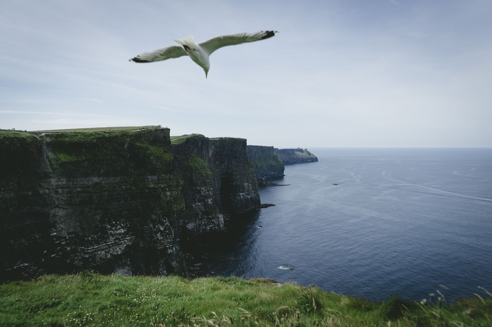
