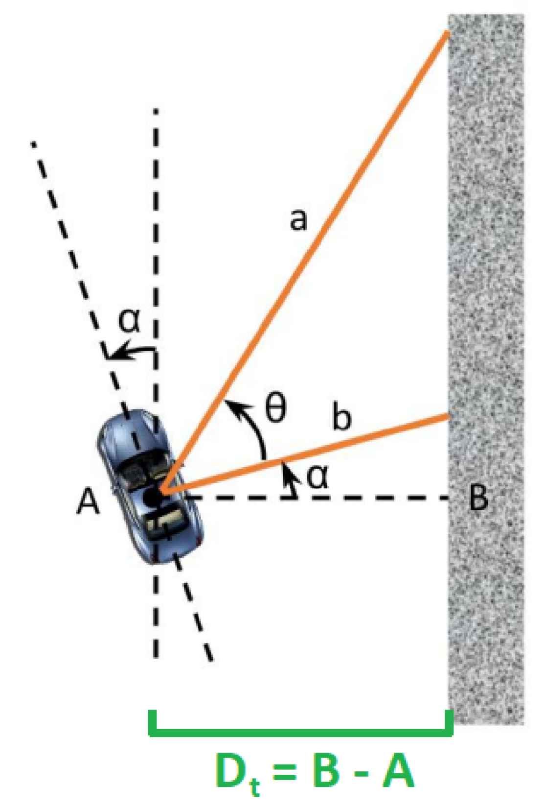
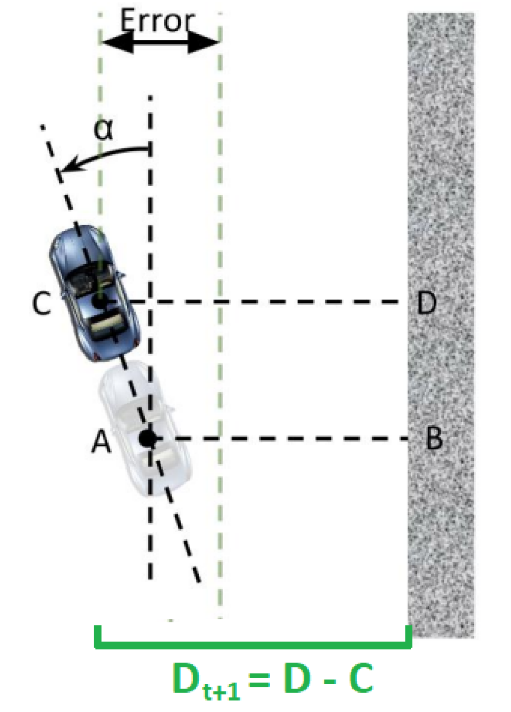

***This series of blogs marks the journey of my F1/10 Autonomous Racing Cars.***

***All my source codes can be accessed [here](https://github.com/shineyruan/F1Tenth_Labs).***

**Previous post:**
- [My F1TENTH Journey — Lab 1, Introduction to ROS](https://zhihaoruan.xyz/2021/01/24/f1tenth-lab1/)
- [My F1TENTH Journey — Lab 2, Automatic Emergency Braking](https://zhihaoruan.xyz/2021/01/25/f1tenth-lab2/)

<!-- more -->

## Lab Materials
The lab materials can be accessed [here](https://f1tenth-coursekit.readthedocs.io/en/stable/assignments/labs/lab3.html#). A PDF version is also attached [here](/files/f110_lab3.pdf). 



The lab was built on the *F1Tenth Simulator*, which can be accessed [here](https://f1tenth.readthedocs.io/en/stable/going_forward/simulator/sim_install.html).

## PID Control Overview
PID (Proportional-Integral-Derivative) control is a way to maintain certain parameters of a system around a specific set point. It is probably one of the most widely-used yet simple method to maintain a stable system. This lab focuses on implementing a wall-following controller of the simulated F1/10 car using PID control algorithms.

The general PID controller in the time domain can be written in the following way:
$$u(t)=K_p e(t) + K_i \int_0^t e(\tau) d\tau + K_d \frac{d}{dt}e(t).$$
where $K_p$, $K_i$ and $K_d$ are tunable weight parameters of the controller, $e(t)$ is the error of current state to the desired state, and $u(t)$ is the control output.

## Wall Following
<p align="center">
    

In the context of our car, we would like to maintain the distance between the wall and our car at a certain desired value. In the image above, we can see that the parameter we would like to control is $D_t$, while we only have LiDAR laser scans in the local car coordinate frame (positive $x$ as the forward direction of the car). 

In order to calculate the distance from laser scans, we choose a laser ray $a$ and a laser ray $b$ such that $b$ is 90 degrees from the orientation of our car, and $a$ is of some other angle between 0 degree and 70 degrees. Then, from basic trigonometry, we have 
$$\alpha=\tan^{-1}\left(\frac{a\cos(\theta)-b}{a\sin(\theta)}\right),$$
and then we can express $D_t$ as 
$$D_t=b\cos\alpha.$$

As we wish to maintain $D_t$ around a certain set point, we define the error term of our PID controller as $e(t)=D_0-D_t$.

What's more, we would also like to define a **look-ahead distance** as in real practice our car will be running in high speed and there might be some delays for the car to maneuver as our control command is sent.

<p align="center">
    

The look-ahead distance $D_{t+1}$ can be defined as $D_{t+1}=D_t+L\sin\alpha$, where $L$ is some tunable parameters.

## Implementing the PID Controller
With the error term $e(t)$ properly defined, it is not difficult for us to implement the controller. Classical PID controllers are often implemented in a discrete, recursive way, which has the following:
```cpp
// double integral = 0;  // defined at initialization

double pid_control() {
    double dt = current_time - prev_time;
    integral += error * dt;
    double derivative = (error - prev_error) / dt;

    return K_p * error + K_i * integral + K_d * derivative;
}
```

## PID Tuning
Tuning the PID controller is never an easy task. Sometimes the three parameters $K_p, K_i, K_d$ can be very problematic to tune. From my experience I would try in the following way:
1. First, adjust $K_p$ to the maximum gain value (value with max performance), keeping $K_i=0, K_d=0$.
2. Second, tune $K_i$ to the maximum gain value.
3. Last, tune $K_d$ to eliminate the system oscillations. 

We can also use the [Ziegler–Nichols method](https://en.wikipedia.org/wiki/Ziegler%E2%80%93Nichols_method) to tune PID controller step by step.

## Demo video
This video demos the wall follower without any look-ahead distance. The car would run into the wall at the bottom side of the corridor.


This video demonstrates the wall follower with proper look-ahead distance adjustment, and the car is able to finish an entire loop with no collisions.


## References
F1/10 Autonomous Racing Lecture: PID Controller & Laplacian Domain


