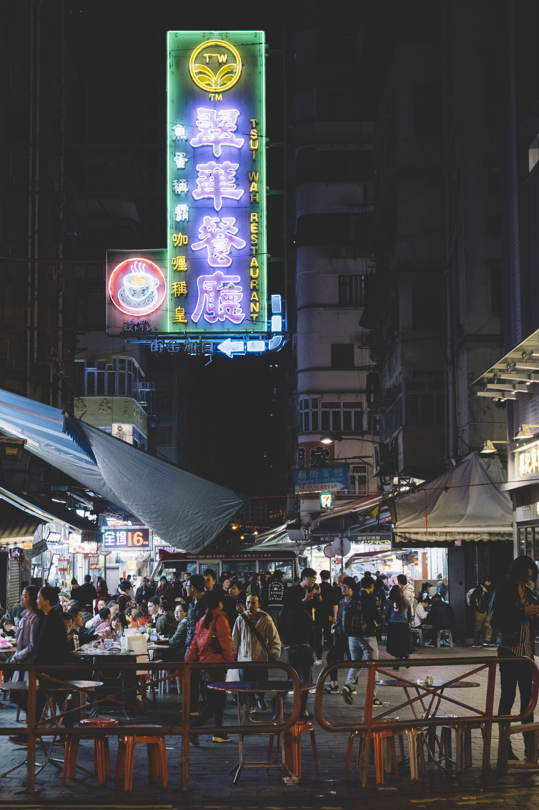
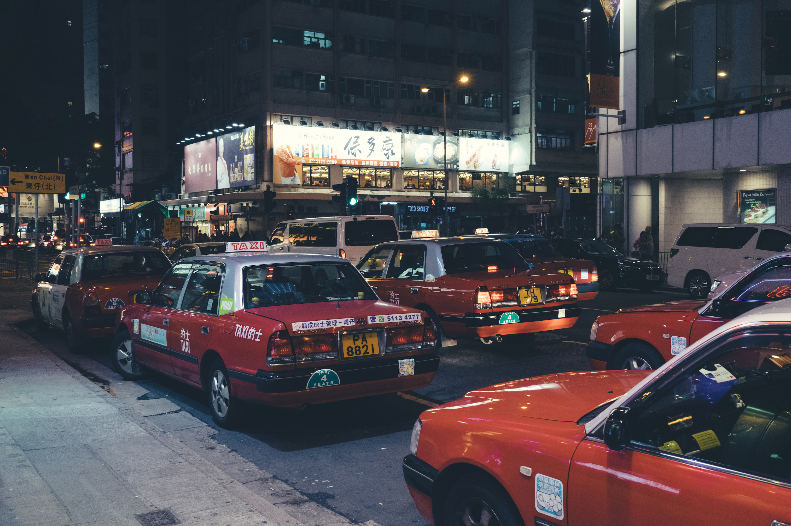
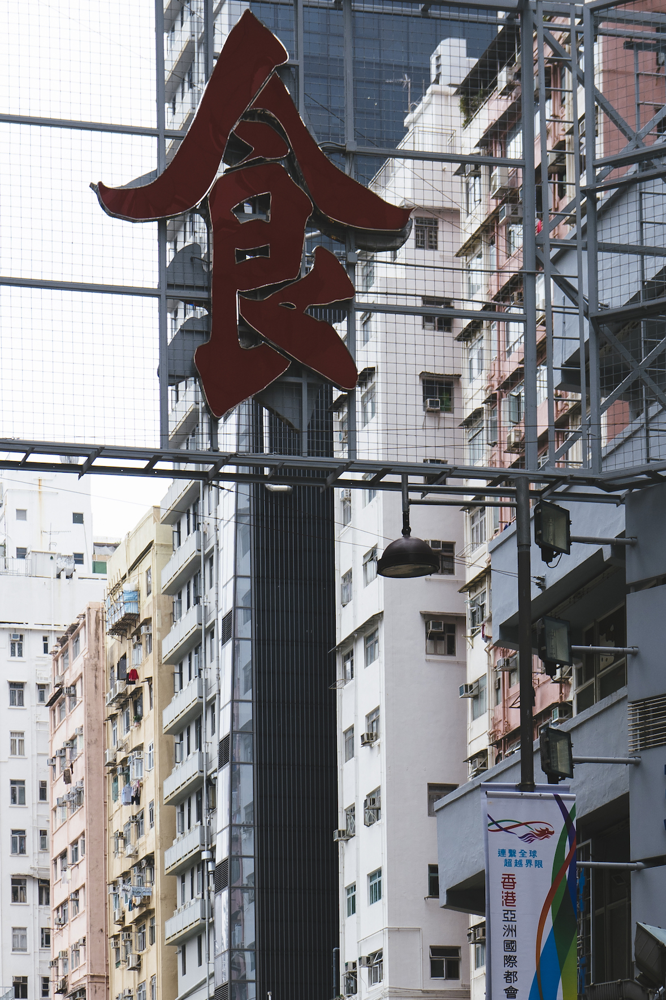

Hong Kong has been one of the fastest developing metropolis in China. When I was young, my impression of Hong Kong came with the Hong Kong TV shows. Hongkongers were so good at joking and acting that their movies and TV shows have had significant influences on me, especially with the fact that I can understand Cantonese :-). Not only me but also Chinese people in the 1980s and 1990s were greatly influenced by Hong Kong cultures.

Hong Kong is famous for its fast-developing metropolitan scenery, with a local nickname as "Forest of Steel/Urban Forest" (Chinese: 钢铁森林). Personally I think the nickname really describes the essence of Hong Kong &mdash; a place full of so many skyscrapers that almost covers the sky!

Hong Kong is also extremely crowded and busy. It is a tiny piece of land filled with millions of people. As a matter of fact, Hongkongers are experts in fully utilizing vertical spaces in every corner of the city.

<!-- more -->

")

. It is famous for its crowded stalls, selling all kinds of food, clothes and handicrafts.")

Every metropolis has its dark side. Behind the crowd and business, a small alley in Hong Kong was filled with all kinds of trash. Besides the dirtiness, a big banner of "Welcome" hanging across the alley seems to have some kind of deep meaning behind the words.

