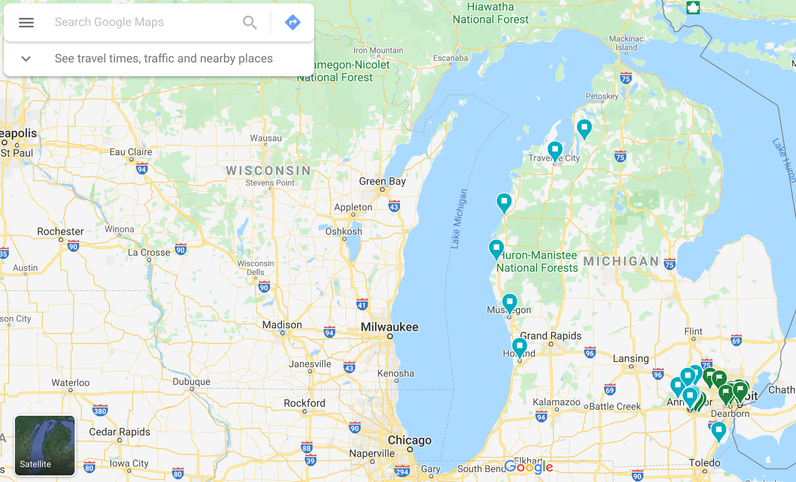
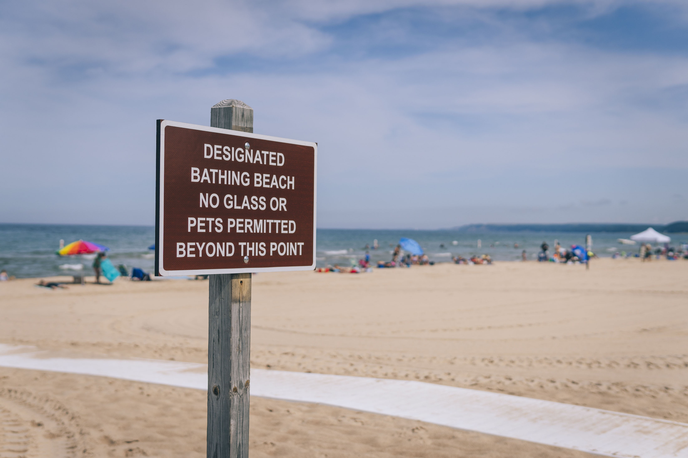
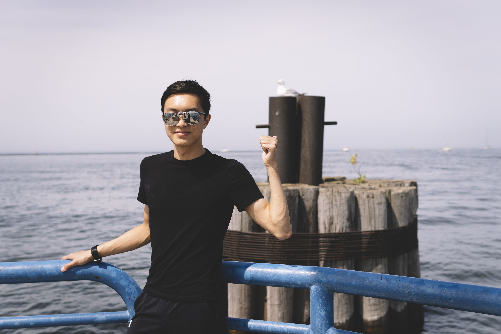
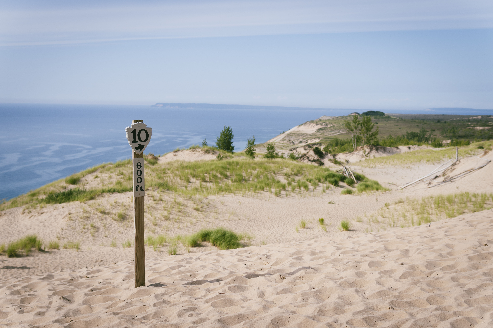
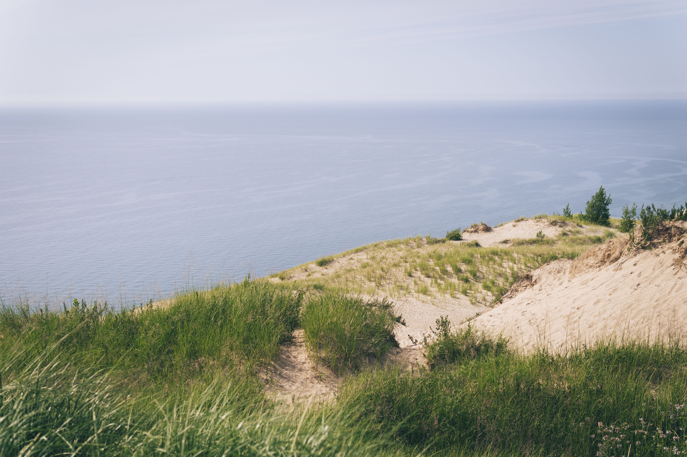
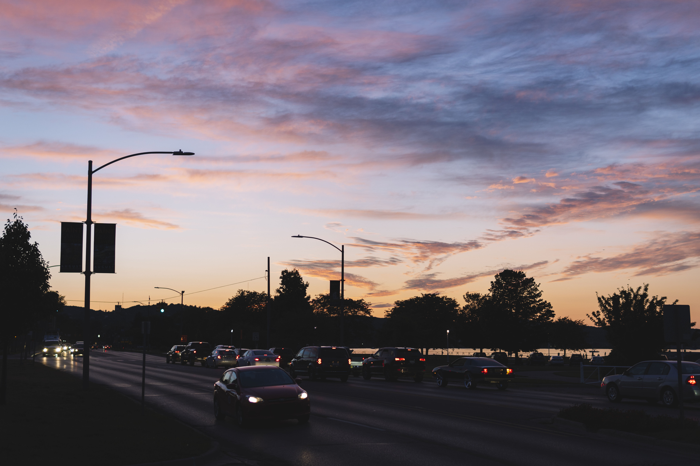

As a travelling enthusiast, there is no doubt that the state where I lived must somehow appear on my wishlist. During the two years in Ann Arbor, I also spent some time to explore Michigan.

<!-- more -->

What represents Michigan? It is very easy to think of the slogan of the State of Michigan &mdash; "Pure Michigan." However, in what way does the State of Michigan look pure? Clearly it shouldn't be the way in which Detroit and Lansing look. Although Michigan doesn't seem to be among the most popular states for tourism to foreigners, there are a lot of beautiful state parks as well as national parks in Michigan that make the state "pure." I would like to categorize these places in two sections: *the west part of Michigan (Western Michigan)* and *the north part of Michigan (Northern Michigan)*.

## Western Michigan

The views in the west part of Michigan mainly comes from Lake Michigan, which is one of the five great lakes between the US-Canada border. On the west coast of the lake lies the State of Illinois and the State of Wisconsin, whereas on the east coast lies the State of Michigan. Lake Michigan is such a great lake that a large number of beaches has formed along its coast. **It also produces strong wind due the combination of its location and the climate, which is the reason why Chicago is known as the "Windy City."** Generally, Lake Michigan can be viewed as a sea, and spending holidays by Lake Michigan is very much similar to the feelings of enjoying a seaside life.

During the past summer, I have visited several towns by Lake Michigan, including Muskegon, Pentwater, Manistee, Traverse City, and the famous Sleeping Bear Dunes.

Sleeping Bear Dunes is a famous national lakeshore at Western Michigan. There is indeed a number of great sand dunes by the lake. Although it might seem weird to most people that sand dunes should not be formed in such a wet climate, it is actually the result of special geological movements & climates. The lake there is pure blue, in a sharp contrast with the yellowish sand dunes, overall producing a spectacular view.

Traverse City is one of the few big cities in Western Michigan. The city has become a place for holidays. Countless tourists come here to enjoy a great view of the Great Lakes. I captured a beautiful sunset that day in the city.

