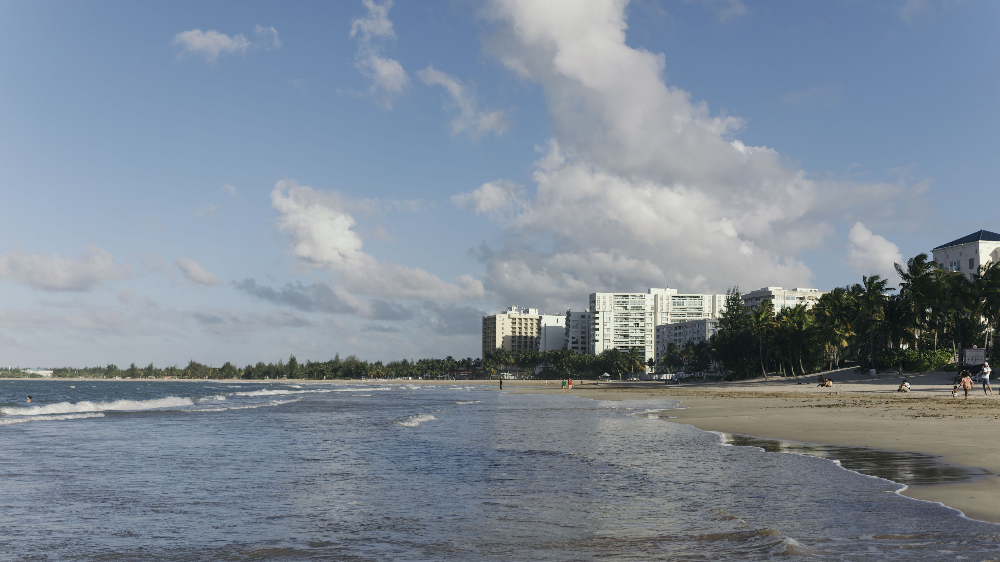

2020年注定是不平凡的一年。毕业在即，申请季结束，心思也就像一匹脱缰的野马，飞到了遥远的异国他乡 &mdash; 是的，又到春假了，是该出去走走的时候了。然而COVID-19肺炎疫情突然爆发，原本辛辛苦苦讨论好的欧洲之行也随之泡汤。本着一颗不甘心留在大雪纷飞的北方过冬的心，波多黎各计划就此成行。

<!-- more -->

由于是在Ann Arbor，我们从底特律出发。出发的那天特别早。大概早晨六点多，我们就打车去了机场。



波多黎各自由邦位于中美洲，靠近多米尼加共和国和古巴，是加勒比海上的一个小岛，岛上的官方语言是英语和西班牙语。由于地处热带，波多黎各也拥有非常迷人的海滩，椰树和阳光，气候温暖湿润。除此之外，波多黎各最久负盛名的就是得天独厚的“加勒比海蓝”。3月初的天气不冷不热，刚好是前往热带度假的好时机。







每天傍晚从外面玩完归来，我都喜欢在民宿楼下的海边散步。走着走着就不由得感叹，这里的海太舒服了，太惬意了。波多黎各当地人的生活节奏也很慢，大家都喜欢慢慢悠悠地享受滋润的海边生活。





## Viejo San Juan 圣胡安老城
波多黎各最大的城市，也是它的首府，叫圣胡安 (San Juan)。圣胡安被划成了老城区和新城区，其中新城区大都聚集了很多现代的餐饮娱乐场所，比如酒吧街，购物广场等等，而老城区则保留了西班牙殖民时期鲜艳明亮的西班牙风格，有很多颜色鲜艳的小房子。除此之外，圣胡安老城区的海边还有两座古堡，应该是为了海事防御而建造的城堡。

### 圣胡安古堡
其实，个人觉得圣胡安的古堡没有太多的历史可以慢慢品味。然而，还是由于这个加勒比小岛上的阳光和海实在太漂亮，古堡里许多地方也就成了游客前来拍照打卡的圣地。





### 老城
圣胡安的老城街道有非常鲜明的西班牙风格。这里的每一栋房子都被刷上鲜艳的颜色，不同颜色的房子紧挨着，形成一条条五颜六色的街道。小房子里有很多很有意思的小店和饭馆，街上人来人往。与大城市不同的是，这里的人们都非常的闲适而自由，老头老太们在店门口抽烟，年轻人三三两两在露天酒吧里喝着小酒吹着海风，街头艺人演奏着热情的中美洲音乐。走在街上，你会感到这个世界的安静与美好。







众所周知，波多黎各在2017年遭受了飓风“玛丽亚”的袭击，几乎全岛被摧毁。在老城区里，有一棵被飓风连根拔起的树倒在了草丛里。然而，事后这里的人们却依然热情地在这棵树的根部涂上了自己国旗的颜色。



值得一提的是这里不仅房子都五彩斑斓，就连大停车楼也被涂上了五颜六色的图案。整个老城区都被画笔刷上了丰富的颜色。

## 环岛游
除了在圣胡安市区以外，我们还选了一天，绕着整个（其实准确来说是半个）岛游了一圈。我们计划从圣胡安出发，一路向西，一路向南，一直到西南角的尽头，然后天黑再返回圣胡安。

波多黎各朝北的海滩真的很漂亮，整个大海由远到近都充满着加勒比海的碧蓝。迎面吹来温暖舒适的海风，让人久久不能忘怀。



中途还出现了一段小插曲。由于我们在朝西开的路上停留时间实在太久，比预期到达西南角的时间严重滞后，我们只好依依不舍地放弃了从西北往西南开的路上的所有景点。在半路上天公不作美，乌云密布开始下起了雨。我曾经一度认为我们可能已经提前享受完这一天美好的阳光，可能往前开也没有很大意义了。然而，车里的同行朋友们给了我坚持下去的勇气。终于，在太阳快要下山的时候，天重新开始放晴了。我们赶着最后一点阳光到达了整个岛的西南角，看到了绝美的海上夕阳。

在大海落下去的夕阳，实在是太美了，太美了。任何词汇都形容不出那种仿佛站在天涯海角，世界尽头的感觉。我从未感受过那么辽阔的苍穹和大海，我甚至可以肉眼看出地球表面的弧度。天黑以后，头顶上换成了满天的繁星。







随后，我们便按照原计划开回圣胡安。大家都太累了。那天我们都睡得特别香。

## 结语
五天的时间，其实挺快的。我们又重新回到了寒冷的北方。很快，我们又将各自投入到繁忙的工作和学习之中。但是，那些关于夏天的记忆，永远不会消褪。

(Co-authored by: [K.H.](https://kunhwang1998.github.io/))
