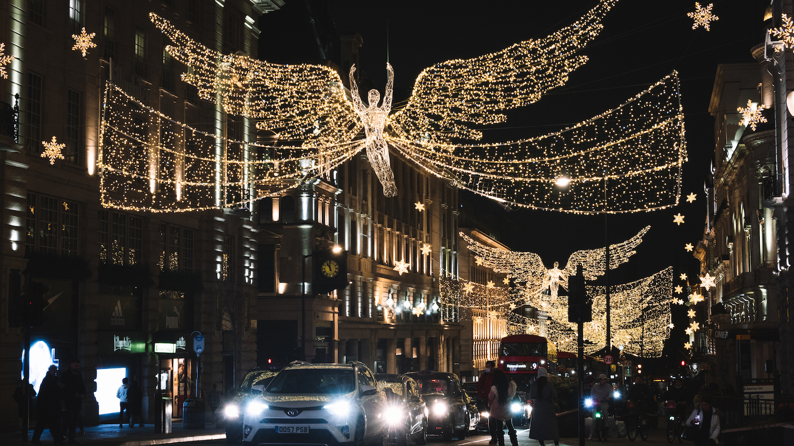
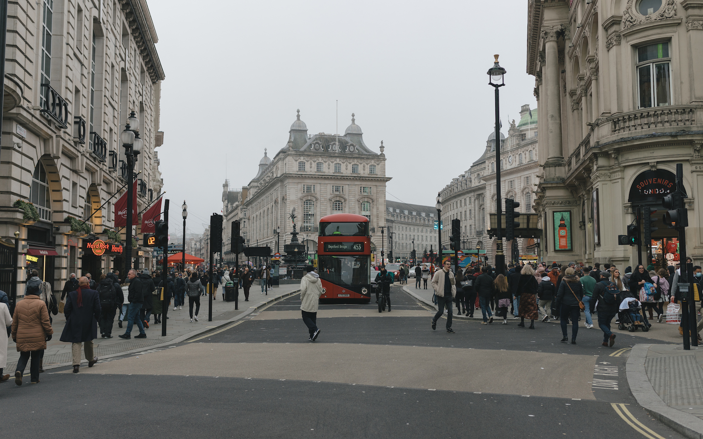

# London, UK

In this winter, I finally got a chance to visit and spend a nice Christmas holiday in UK.

<!-- more -->

London is famous for its theaters at West End. Along with New York City's Broadway theatre, West End theatre is usually considered to represent the highest level of commercial theatre in the English-speaking world. Seeing a West End show is a common tourist activity in London.

